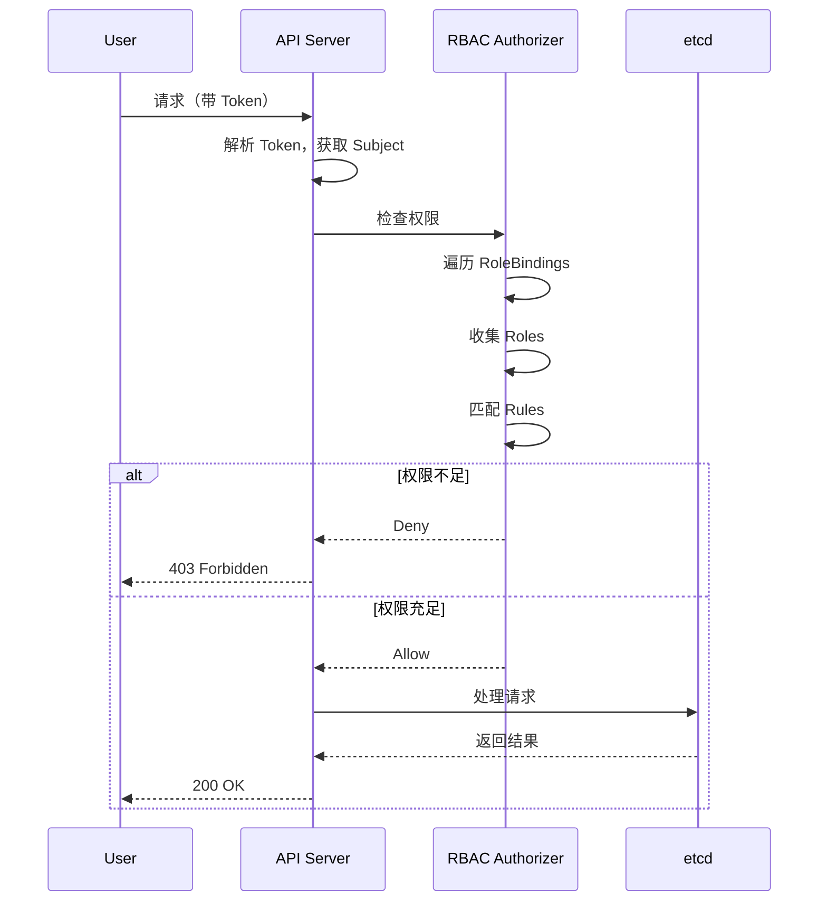

# Kubernetes 安全机制深度解析

## 概述

Kubernetes 提供了多层安全机制，包括：
- ServiceAccount 身份标识
- Token 管理和认证
- RBAC（Role-Based Access Control）权限控制
- Pod Security Context 容器安全配置
- Secret 敏感数据管理
- Pod Security Admission Pod 安全策略

本文档深入分析 Kubernetes 的安全机制、实现原理和最佳实践。

---

## 一、ServiceAccount 机制

### 1.1 ServiceAccount 概述

ServiceAccount 为 Pod 提供身份标识：
- 每个 Pod 绑定到一个 ServiceAccount
- ServiceAccount 提供 Token 用于 API 认证
- 支持自动挂载 Secret（Token）

### 1.2 ServiceAccount 控制器

**文件：** `pkg/controller/serviceaccount/serviceaccounts_controller.go`

```go
type ServiceAccountsController struct {
    client                  clientset.Interface
    serviceAccountsToEnsure []v1.ServiceAccount

    queue   workqueue.TypedRateLimitingInterface[string]
    saLister corelisters.ServiceAccountLister
    nsLister corelisters.NamespaceLister
}
```

**核心功能：**
- 确保每个命名空间存在默认 ServiceAccount
- 为 ServiceAccount 自动创建 Token Secret
- 管理 ServiceAccount 的生命周期

### 1.3 ServiceAccount 调谐流程

```go
func (e *ServiceAccountsController) syncServiceAccount(ctx context.Context, key string) error {
    // 1. 获取 ServiceAccount
    sa, err := e.saLister.ServiceAccounts(namespace).Get(name)
    if errors.IsNotFound(err) {
        // ServiceAccount 不存在，创建
        sa, err := e.client.CoreV1().ServiceAccounts(namespace).Create(ctx, sa)
        if err != nil {
            return err
        }
    }

    // 2. 确保 Token Secret 存在
    if err := e.ensureServiceAccountTokenSecret(ctx, sa); err != nil {
        return err
    }

    return nil
}
```

### 1.4 ServiceAccount YAML 示例

```yaml
apiVersion: v1
kind: ServiceAccount
metadata:
  name: my-serviceaccount
automountServiceAccountToken: false  # 禁用自动挂载 Token
secrets:
  - name: my-secret  # 关联的 Secret
imagePullSecrets:
  - name: my-registry-secret  # 镜像仓库 Secret
```

---

## 二、Token 机制

### 2.1 Token 类型

Kubernetes 支持多种 Token 类型：

#### 1. Legacy ServiceAccount Token
- 旧版 ServiceAccount Token
- 使用 JWT 格式
- 长期有效
- 不推荐使用

#### 2. ServiceAccount Token（v1）
- 新版 ServiceAccount Token
- 包含 Audience 字段
- 支持过期时间
- 默认 1 年有效期

#### 3. Bootstrap Token
- 用于节点加入集群
- 用于 kubelet 认证
- 可以设置用途和 TTL

### 2.2 Token 控制器

**文件：** `pkg/controller/serviceaccount/tokens_controller.go`

```go
type TokensController struct {
    client     clientset.Interface
    tokenGetter serviceaccount.TokenGetter

    queue      workqueue.TypedRateLimitingInterface[string]
    saLister   corelisters.ServiceAccountLister
    secretLister corelisters.SecretLister
}
```

**核心功能：**
- 为 ServiceAccount 生成 Token
- 管理 Token 的生命周期
- 自动 Token 轮换

### 2.3 Token 创建流程

```go
func (e *TokensController) syncServiceAccount(ctx context.Context, key string) error {
    // 1. 获取 ServiceAccount
    sa, err := e.saLister.ServiceAccounts(namespace).Get(name)
    if errors.IsNotFound(err) {
        return nil
    }

    // 2. 检查是否需要生成 Token
    if !e.shouldGenerateToken(sa) {
        return nil
    }

    // 3. 生成 Token
    tokenData, err := e.tokenGetter.CreateToken(ctx, sa)
    if err != nil {
        return err
    }

    // 4. 创建 Secret 存储 Token
    secret := &v1.Secret{
        ObjectMeta: metav1.ObjectMeta{
            Name:      tokenSecretName(sa.Name),
            Namespace: sa.Namespace,
            Annotations: map[string]string{
                v1.ServiceAccountNameKey: sa.Name,
                v1.ServiceAccountUIDKey:  string(sa.UID),
            },
        },
        Type: v1.SecretTypeServiceAccountToken,
        Data: map[string][]byte{
            v1.ServiceAccountTokenKey: []byte(tokenData),
        },
    }

    _, err = e.client.CoreV1().Secrets(sa.Namespace).Create(ctx, secret)
    return err
}
```

---

## 三、RBAC 机制

### 3.1 RBAC 概述

RBAC（Role-Based Access Control）是 Kubernetes 的核心授权机制：
- 基于角色的访问控制
- 细粒度权限管理
- 支持命名空间和集群范围

### 3.2 RBAC 对象

#### 1. Role
定义命名空间级别的权限：

```yaml
apiVersion: rbac.authorization.k8s.io/v1
kind: Role
metadata:
  namespace: default
  name: pod-reader
rules:
  - apiGroups: [""]
    resources: ["pods"]
    verbs: ["get", "list", "watch"]
```

#### 2. ClusterRole
定义集群级别的权限：

```yaml
apiVersion: rbac.authorization.k8s.io/v1
kind: ClusterRole
metadata:
  name: cluster-admin
rules:
  - apiGroups: ["*"]
    resources: ["*"]
    verbs: ["*"]
```

#### 3. RoleBinding
将 Role 绑定到用户、组或 ServiceAccount：

```yaml
apiVersion: rbac.authorization.k8s.io/v1
kind: RoleBinding
metadata:
  name: read-pods
  namespace: default
subjects:
  - kind: ServiceAccount
    name: my-serviceaccount
    namespace: default
roleRef:
  kind: Role
  name: pod-reader
  apiGroup: rbac.authorization.k8s.io
```

#### 4. ClusterRoleBinding
将 ClusterRole 绑定到用户、组或 ServiceAccount：

```yaml
apiVersion: rbac.authorization.k8s.io/v1
kind: ClusterRoleBinding
metadata:
  name: admin-binding
subjects:
  - kind: ServiceAccount
    name: my-serviceaccount
    namespace: default
roleRef:
  kind: ClusterRole
  name: cluster-admin
  apiGroup: rbac.authorization.k8s.io
```

### 3.3 RBAC 授权流程



### 3.4 RBAC 授权实现

**文件：** `pkg/kubeapiserver/authorizer/modes/modes.go`

```go
type RBACAuthorizer struct {
    authorizer.Attributes
    roleLister    rbacregistry.RoleLister
    roleBindingLister rbacregistry.RoleBindingLister
    clusterRoleLister    rbacregistry.ClusterRoleLister
    clusterRoleBindingLister rbacregistry.ClusterRoleBindingLister
}

func (r *RBACAuthorizer) Authorize(ctx context.Context, attr authorizer.Attributes) (authorizer.Decision, string, error) {
    // 1. 获取用户信息
    user := attr.GetUser()

    // 2. 检查 ClusterRoleBindings
    clusterRoles, err := r.getClusterRoles(user)
    if err != nil {
        return authorizer.DecisionDeny, "", err
    }

    // 3. 收集所有 ClusterRoles 的 Rules
    rules := r.getRules(clusterRoles)

    // 4. 检查请求是否匹配任意 Rule
    if r.matchesRules(rules, attr) {
        return authorizer.DecisionAllow, "", nil
    }

    return authorizer.DecisionDeny, "", nil
}
```

---

## 四、Pod Security Context

### 4.1 Pod Security Context 概述

Pod Security Context 定义容器的安全配置：
- 运行时用户和组
- 文件系统只读
- Linux Capabilities
- SELinux/AppArmor 配置
- Seccomp 配置

### 4.2 Pod Security Context 字段

```yaml
apiVersion: v1
kind: Pod
metadata:
  name: my-pod
spec:
  securityContext:
    runAsUser: 1000           # 以 UID 1000 运行
    runAsGroup: 3000          # 以 GID 3000 运行
    fsGroup: 2000              # 容器文件系统 GID
    runAsNonRoot: true          # 容器以非 root 运行
    readOnlyRootFilesystem: false # 容器文件系统只读
    capabilities:
      add:  # 添加 Capabilities
        - NET_ADMIN
      drop: [ALL] # 移除所有 Capabilities
    seLinuxOptions:
      level: "s0:c234,c563"  # SELinux 标签
    seccompProfile:
      type: "RuntimeDefault"  # Seccomp 配置文件
```

### 4.3 Container Security Context

```yaml
apiVersion: v1
kind: Pod
spec:
  containers:
  - name: my-container
    securityContext:
      runAsUser: 1000
      runAsGroup: 3000
      readOnlyRootFilesystem: true
      allowPrivilegeEscalation: false
```

---

## 五、Secret 管理

### 5.1 Secret 概述

Secret 用于存储敏感数据：
- 支持多种类型：Opaque、ServiceAccountToken、TLS、docker-registry
- 存储在 etcd 中，使用 base64 编码
- 支持环境变量和卷挂载

### 5.2 Secret 类型

```yaml
# Opaque 类型
apiVersion: v1
kind: Secret
metadata:
  name: my-secret
type: Opaque
data:
  username: YWRtaW4dX2
  password: cGFzc3dvcmQ=
```

```yaml
# TLS 类型
apiVersion: v1
kind: Secret
metadata:
  name: my-tls-secret
type: kubernetes.io/tls
data:
  tls.crt: <base64-encoded-cert>
  tls.key: <base64-encoded-key>
```

### 5.3 Secret 使用方式

#### 1. 环境变量
```yaml
apiVersion: v1
kind: Pod
spec:
  containers:
  - name: my-container
    env:
      - name: USERNAME
        valueFrom:
          secretKeyRef:
            name: my-secret
            key: username
      - name: PASSWORD
        valueFrom:
          secretKeyRef:
            name: my-secret
            key: password
```

#### 2. 卷挂载
```yaml
apiVersion: v1
kind: Pod
spec:
  containers:
  - name: my-container
    volumeMounts:
      - name: secret-volume
        mountPath: /etc/secrets
        readOnly: true
  volumes:
    - name: secret-volume
      secret:
        secretName: my-secret
        defaultMode: 0400  # 设置文件权限
```

---

## 六、Pod Security Admission

### 6.1 Pod Security Admission 概述

Pod Security Admission（PSA）是新的 Pod 安全策略机制：
- 替代已废弃的 PodSecurityPolicy
- 支持命名空间级别和集群级别的策略
- 支持 Audit（审计）、Warn（警告）、Enforce（强制）三种模式

### 6.2 Pod Security Standards

#### 1. Privileged
```yaml
apiVersion: v1
kind: Pod
metadata:
  name: privileged-pod
spec:
  containers:
  - name: my-container
      securityContext:
        privileged: true
```

**策略检查：**
```yaml
apiVersion: v1
kind: PodSecurityPolicy
metadata:
  name: privileged
spec:
  privileged: false
  allowPrivilegeEscalation: false
  requiredDropCapabilities:
    - ALL
```

#### 2. Root User
```yaml
apiVersion: v1
kind: Pod
spec:
  securityContext:
    runAsUser: 0  # 以 root 运行
```

**策略检查：**
```yaml
apiVersion: v1
kind: PodSecurityPolicy
metadata:
  name: root-user
spec:
  runAsUser:
    rule: MustRunAsNonRoot
```

### 6.3 Pod Security Admission 配置

#### 1. 命名空间级别
```yaml
apiVersion: v1
kind: Namespace
metadata:
  name: my-namespace
  labels:
    pod-security.kubernetes.io/audit: baseline
    pod-security.kubernetes.io/warn: restricted
    pod-security.kubernetes.io/enforce: restricted
```

#### 2. 集群级别
```yaml
apiVersion: v1
kind: ClusterPodSecurityPolicy
metadata:
  name: cluster-restricted
spec:
  baseline: "baseline"
  restricted: "restricted"
  enforce-version: latest
```

---

## 七、安全最佳实践

### 7.1 ServiceAccount 最佳实践

1. **为每个应用创建专用 ServiceAccount**
   - 最小权限原则
   - 避免使用默认 ServiceAccount

2. **禁用自动挂载 Token**
   ```yaml
   automountServiceAccountToken: false
   ```

3. **使用 Secret 存储敏感数据**
   - 不要在环境变量中传递密码
   - 使用卷挂载方式

### 7.2 RBAC 最佳实践

1. **遵循最小权限原则**
   - 只授予必要的权限
   - 定期审计和清理

2. **使用命名空间隔离**
   - 不同应用使用不同命名空间
   - 避免使用 ClusterRole 除非必要

3. **定期审计 RBAC 规则**
   ```bash
   kubectl get roles,rolebindings,clusterroles,clusterrolebindings --all-namespaces
   ```

4. **使用 RBAC 查询工具**
   ```bash
   kubectl auth can-i list pods --as system:serviceaccount:my-sa -n default
   ```

### 7.3 Pod Security 最佳实践

1. **以非 root 用户运行容器**
   ```yaml
   runAsNonRoot: true
   ```

2. **删除不必要的 Capabilities**
   ```yaml
   capabilities:
     drop:
       - ALL
     add:
       - NET_BIND_SERVICE
   ```

3. **使用 Pod Security Admission**
   ```yaml
   labels:
     pod-security.kubernetes.io/enforce: restricted
   ```

4. **使用只读文件系统**
   ```yaml
   readOnlyRootFilesystem: true
   ```

### 7.4 Secret 最佳实践

1. **加密 Secret 数据**
   - 使用外部加密方案
   - 考虑使用 KMS

2. **限制 Secret 访问**
   - 使用 RBAC 控制 Secret 访问
   - 定期轮换 Secret

3. **使用 external Secrets Operator**
   - 从外部密钥管理系统同步
   - 避免在 Kubernetes 中存储

---

## 八、故障排查

### 8.1 常见问题

#### 1. 403 Forbidden
**症状：** 请求被拒绝

**排查：**
- 检查 RBAC 规则
- 使用 `kubectl auth can-i` 测试权限
- 检查 Token 是否有效

```bash
kubectl auth can-i get pods --as system:serviceaccount:my-sa -n default
```

#### 2. Pod 无法启动
**症状：** Pod 处于 `Failed` 状态

**排查：**
- 检查 Pod Security Policy 是否拒绝
- 检查镜像拉取权限
- 检查 ServiceAccount Token 是否有效

```bash
kubectl describe pod <pod-name>
kubectl get events --sort-by='.lastTimestamp'
```

#### 3. Secret 无法访问
**症状：** 容器无法读取 Secret

**排查：**
- 检查 RBAC 权限
- 检查 Secret 是否存在
- 检查 Pod 是否正确挂载 Secret

### 8.2 安全审计

```bash
# 列出所有 RoleBindings
kubectl get rolebindings,clusterrolebindings --all-namespaces

# 查找过度权限的 Roles
kubectl describe clusterrole cluster-admin

# 检查 ServiceAccount 权限
kubectl describe serviceaccount <sa-name> -n <namespace>

# 审计 Pod Security Policy 违规
kubectl get podsecuritypolicies --all-namespaces
```

---

## 九、关键代码路径

### 9.1 ServiceAccount
```
pkg/controller/serviceaccount/
├── serviceaccounts_controller.go       # ServiceAccount 控制器
├── tokens_controller.go                # Token 控制器
└── tokengetter.go                    # Token 生成器
```

### 9.2 RBAC
```
pkg/apis/rbac/v1/
├── types.go                           # RBAC 类型定义
├── register.go                        # 注册
└── helpers.go                          # 辅助函数
```

### 9.3 授权器
```
pkg/kubeapiserver/authorizer/
├── modes/modes.go                     # RBAC 授权器
├── modes/modes_test.go                  # 测试
└── config.go                          # 配置
```

### 9.4 Secret
```
staging/k8s.io/apiserver/pkg/storage/value/
├── etcd.go                            # etcd 存储
└── secret.go                           # Secret 存储
```

---

## 十、总结

### 10.1 安全机制特点

1. **多层安全**：认证、授权、准入控制多层保护
2. **最小权限原则**：RBAC 和 PSA 都遵循最小权限
3. **自动化管理**：ServiceAccount 和 Token 自动管理
4. **灵活控制**：支持命名空间和集群级别的策略
5. **审计和监控**：支持审计日志和事件记录

### 10.2 关键流程

1. **认证流程**：Token → 解析 Subject → 授权检查
2. **授权流程**：Subject → RoleBindings → Rules → 决策
3. **Secret 流程**：Secret 创建 → 挂载到 Pod → 容器访问
4. **PSA 流程**：Pod 创建 → PSA 检查 → Allow/Deny/Warn

### 10.3 最佳实践

1. **ServiceAccount**：专用 SA、禁用自动 Token、使用 Secret
2. **RBAC**：最小权限、命名空间隔离、定期审计
3. **Pod Security**：非 root、删除 Capabilities、PSA 策略
4. **Secret**：加密、限制访问、外部管理

---

## 参考资源

- [Kubernetes RBAC 文档](https://kubernetes.io/docs/concepts/security/rbac/)
- [Kubernetes Pod Security 文档](https://kubernetes.io/docs/concepts/security/pod-security-standards/)
- [Kubernetes Secret 文档](https://kubernetes.io/docs/concepts/configuration/secret/)
- [Kubernetes 安全最佳实践](https://kubernetes.io/docs/concepts/security/overview/)

---

**文档版本**：v1.0
**最后更新**：2026-03-03
**分析范围**：Kubernetes v1.x
