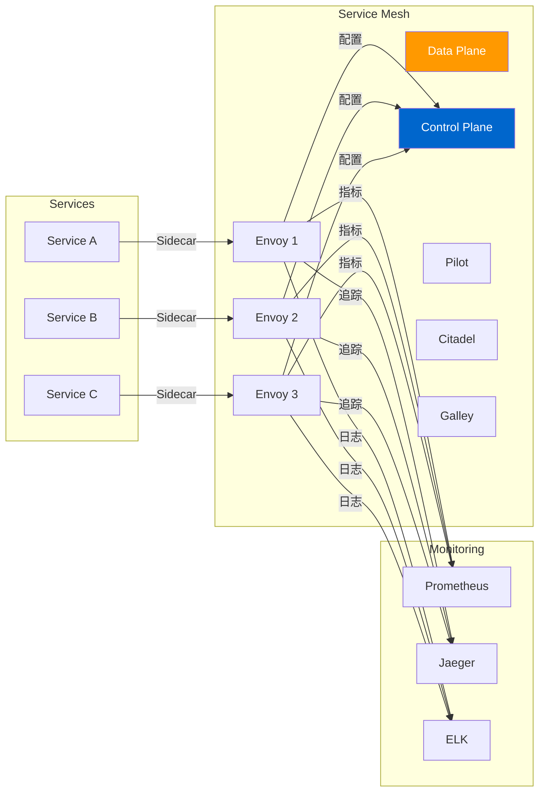
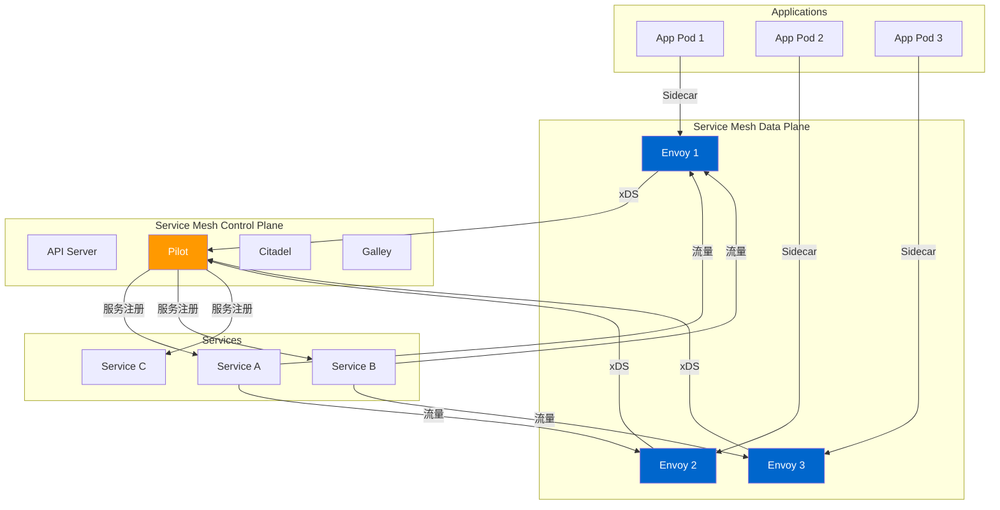
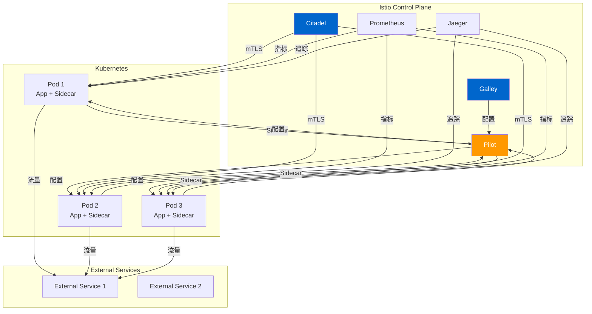
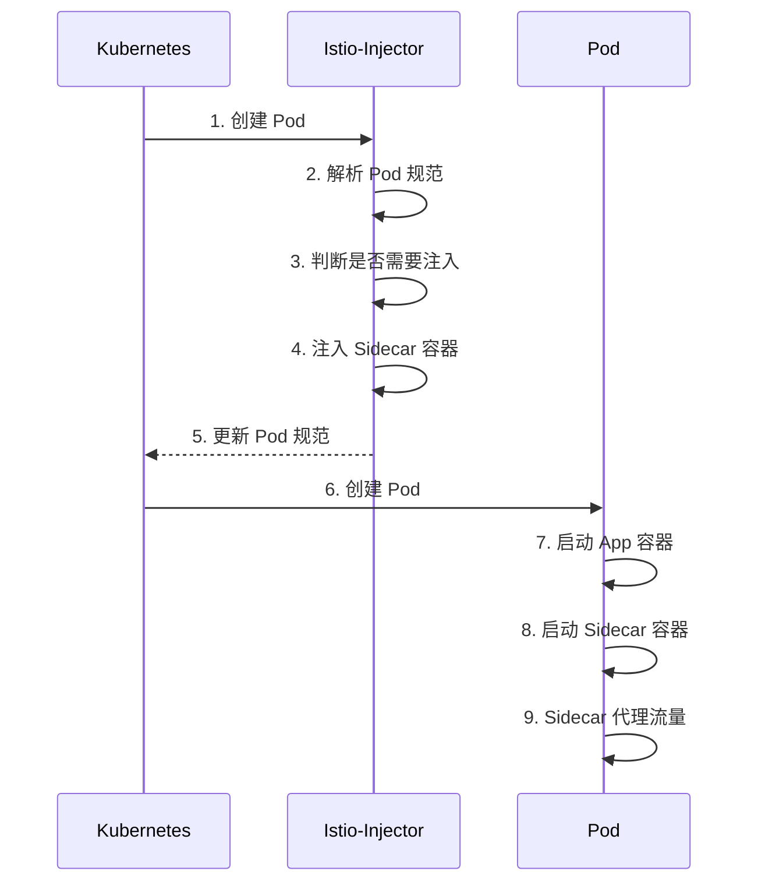
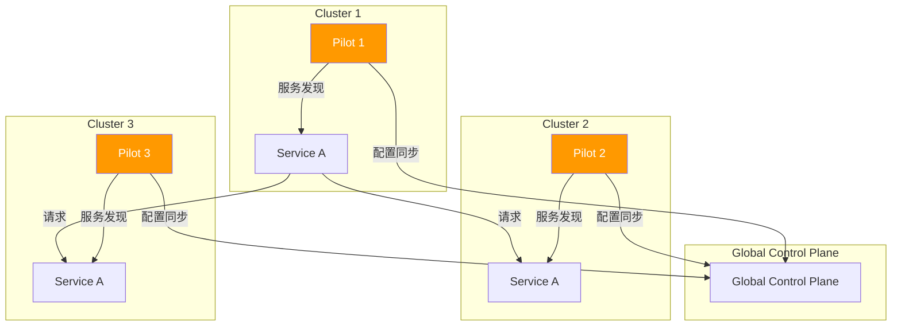

# Service Mesh (Istio) 深度分析

> 本文档深入分析 Service Mesh 和 Istio，包括架构、Sidecar 注入、流量管理、安全策略、可观测性和多集群管理。

---

## 目录

1. [Service Mesh 概述](#service-mesh-概述)
2. [Service Mesh 架构](#service-mesh-架构)
3. [Istio 架构](#istio-架构)
4. [Sidecar 注入机制](#sidecar-注入机制)
5. [流量管理](#流量管理)
6. [安全策略](#安全策略)
7. [可观测性](#可观测性)
8. [多集群管理](#多集群管理)
9. [性能优化](#性能优化)
10. [故障排查](#故障排查)

---

## Service Mesh 概述

### Service Mesh 的作用

Service Mesh 是一种用于处理服务间通信的基础设施层：



### Service Mesh 的核心特性

| 特性 | 说明 |
|------|------|
| **流量管理**：负载均衡、熔断、重试、超时、金丝雀发布 |
| **服务发现**：自动注册和发现服务 |
| **安全性**：mTLS 加密、身份验证、授权策略 |
| **可观测性**：指标、追踪、日志的统一收集 |
| **策略执行**：统一的流量和安全策略 |
| **多集群**：跨集群的流量管理和故障转移 |

### Service Mesh 的价值

- **透明代理**：对应用代码零侵入
- **统一管理**：统一的流量和安全策略
- **可观测性**：完整的调用链和指标
- **安全性**：零信任网络安全
- **弹性**：自动的故障恢复和重试

---

## Service Mesh 架构

### 整体架构



### 核心组件

#### 1. Data Plane

Data Plane 负责处理服务间的实际流量：

```go
// Proxy 代理接口
type Proxy interface {
    // Serve 处理请求
    Serve(ctx context.Context, req *http.Request) (*http.Response, error)

    // OnConfig 配置更新
    OnConfig(config *proxy.Config) error
}

// EnvoyProxy Envoy 代理实现
type EnvoyProxy struct {
    // Envoy 实例
    envoy *exec.Cmd

    // 配置
    config *proxy.Config

    // Admin 接口
    adminPort int
}
```

#### 2. Control Plane

Control Plane 负责管理配置和策略：

```go
// Pilot Pilot 组件
type Pilot struct {
    // Discovery 服务发现
    Discovery Discovery

    // xDS 服务
    XDS xDS

    // 配置存储
    ConfigStore ConfigStore
}

// Citadel Citadel 组件
type Citadel struct {
    // Identity 身份服务
    Identity Identity

    // CA 证书颁发机构
    CA CA
}
```

---

## Istio 架构

### 整体架构



### Istio 核心组件

#### 1. Pilot

**位置**：`istio.io/istio/pilot`

Pilot 是 Istio 的控制平面组件：

```go
// Discovery 服务发现
type Discovery interface {
    // GetEndpoints 获取服务端点
    GetEndpoints(hostname string, port int) []endpoint.Endpoint

    // WatchEndpoints 监听端点变化
    WatchEndpoints(hostname string, port int) chan []endpoint.Endpoint
}

// xDS 服务
type XDS interface {
    // CreateCluster 创建集群
    CreateCluster(hostname string, port int) (*cluster.Cluster, error)

    // UpdateCluster 更新集群
    UpdateCluster(hostname string, port int) (*cluster.Cluster, error)

    // DeleteCluster 删除集群
    DeleteCluster(hostname string, port int) error
}
```

#### 2. Citadel

**位置**：`istio.io/istio/security`

Citadel 负责处理服务间的安全认证：

```go
// Identity 身份服务
type Identity interface {
    // GetIdentity 获取身份信息
    GetIdentity(hostname string, port int) *identity.Identity

    // CreateIdentity 创建身份
    CreateIdentity(hostname string, port int) (*identity.Identity, error)
}

// CA 证书颁发机构
type CA interface {
    // Sign 签名证书
    Sign(csr *x509.CertificateRequest) (*x509.Certificate, error)

    // Verify 验证证书
    Verify(cert *x509.Certificate) (bool, error)
}
```

#### 3. Galley

**位置**：`istio.io/istio/galley`

Galley 负责配置验证和分发：

```go
// ConfigManager 配置管理器
type ConfigManager interface {
    // Create 创建配置
    Create(config *config.Config) (*config.Config, error)

    // Update 更新配置
    Update(config *config.Config) (*config.Config, error)

    // Delete 删除配置
    Delete(configName string) error

    // Get 获取配置
    Get(configName string) (*config.Config, error)
}
```

---

## Sidecar 注入机制

### 注入流程



### 注入实现

**位置**：`istio.io/istio/pilot/pkg/webhook`

```go
// MutatingWebhook 变更 Webhook
type MutatingWebhook struct {
    // Client Kubernetes 客户端
    client kubernetes.Interface

    // Decoder 解码器
    decoder admission.Decoder
}

// Handle 处理请求
func (m *MutatingWebhook) Handle(ctx context.Context, req admission.Request) admission.Response {
    // 1. 解码请求
    var pod v1.Pod
    if err := m.decoder.Decode(req, &pod); err != nil {
        return admission.Errored(http.StatusBadRequest, err)
    }

    // 2. 判断是否需要注入 Sidecar
    if !m.needsSidecar(&pod) {
        return admission.Allowed("Pod does not need sidecar")
    }

    // 3. 注入 Sidecar 容器
    pod = m.injectSidecar(&pod)

    // 4. 返回 Patch
    patch, err := json.Marshal(pod)
    if err != nil {
        return admission.Errored(http.StatusInternalServerError, err)
    }

    return admission.PatchResponseFromRaw(req, patch)
}

// needsSidecar 判断是否需要注入 Sidecar
func (m *MutatingWebhook) needsSidecar(pod *v1.Pod) bool {
    // 1. 检查注解
    if _, ok := pod.Annotations[istio.SidecarAnnotation]; ok {
        if pod.Annotations[istio.SidecarAnnotation] == istio.SidecarDisabled {
            return false
        }
    }

    // 2. 检查命名空间标签
    if ns, err := m.client.CoreV1().Namespaces().Get(context.TODO(), pod.Namespace); err == nil {
        if _, ok := ns.Labels[istio.InjectionLabel]; ok {
            if ns.Labels[istio.InjectionLabel] == istio.InjectionDisabled {
                return false
            }
        }
    }

    // 3. 检查 Pod 标签
    if _, ok := pod.Labels[istio.SidecarLabel]; ok {
        return true
    }

    // 4. 检查是否已经有 Sidecar
    for _, container := range pod.Spec.Containers {
        if container.Name == istio.ProxyName {
            return false
        }
    }

    return true
}

// injectSidecar 注入 Sidecar 容器
func (m *MutatingWebhook) injectSidecar(pod *v1.Pod) *v1.Pod {
    // 1. 复制 Pod
    newPod := pod.DeepCopy()

    // 2. 注入 Sidecar 容器
    newPod.Spec.Containers = append(newPod.Spec.Containers, istio.ProxyContainer)

    // 3. 更新卷
    newPod.Spec.Volumes = append(newPod.Spec.Volumes, istio.ProxyVolume)

    // 4. 添加注解
    if newPod.Annotations == nil {
        newPod.Annotations = make(map[string]string)
    }
    newPod.Annotations[istio.SidecarAnnotation] = istio.SidecarInjected

    return newPod
}
```

---

## 流量管理

### 路由规则

**位置**：`istio.io/istio/networking/v1alpha3`

```go
// VirtualService 虚拟服务
type VirtualService struct {
    // Hosts 主机
    Hosts []string

    // Gateways 网关
    Gateways []string

    // Http HTTP 路由规则
    Http *HTTPRoute
}

// HTTPRoute HTTP 路由
type HTTPRoute struct {
    // Match 匹配规则
    Match []HTTPMatch

    // Route 路由规则
    Route []HTTPRoute

    // Timeout 超时
    Timeout string
}

// HTTPRoute HTTP 路由规则
type HTTPRoute struct {
    // Destination 目标
    Destination *Destination

    // Weight 权重
    Weight int32
}

// Destination 目标
type Destination struct {
    // Host 目标主机
    Host string

    // Subset 子集
    Subset string

    // Port 目标端口
    Port Port
}
```

### DestinationRule

```go
// DestinationRule 目标规则
type DestinationRule struct {
    // Host 主机
    Host string

    // Subsets 子集
    Subsets []Subset
}

// Subset 子集
type Subset struct {
    // Name 名称
    Name string

    // Labels 标签选择器
    Labels map[string]string

    // TrafficPolicy 流量策略
    TrafficPolicy *TrafficPolicy
}
```

### Traffic Splitting

```yaml
apiVersion: networking.istio.io/v1alpha3
kind: VirtualService
metadata:
  name: reviews
spec:
  hosts:
  - reviews
  http:
  - match:
    - uri:
        prefix: "/v1/reviews"
    route:
    - destination:
        host: reviews-v1
      weight: 90
    - destination:
        host: reviews-v2
      weight: 10
```

### Fault Injection

```yaml
apiVersion: networking.istio.io/v1beta1
kind: VirtualService
metadata:
  name: ratings
spec:
  hosts:
  - ratings
  http:
  - fault:
      delay:
        percentage:
          value: 10
        fixedDelay: 5s
      abort:
        percentage:
          value: 5
        httpStatus: 500
    route:
    - destination:
        host: ratings
```

---

## 安全策略

### mTLS 加密

```go
// PeerAuthentication 对等认证
type PeerAuthentication struct {
    // Selector 选择器
    Selector *v1.LabelSelector

    // MutualTLS mTLS 配置
    MutualTLS *MutualTLS
}

// MutualTLS mTLS 配置
type MutualTLS struct {
    // Mode 模式
    Mode string
}

const (
    // STRICT 严格模式
    STRICT = "STRICT"

    // PERMISSIVE 宽松模式
    PERMISSIVE = "PERMISSIVE"

    // DISABLE 禁用
    DISABLE = "DISABLE"
)
```

### Authorization Policy

```go
// AuthorizationPolicy 授权策略
type AuthorizationPolicy struct {
    // Selector 选择器
    Selector *v1.LabelSelector

    // Action 操作
    Action string

    // Rules 规则
    Rules []Rule

    // When 条件
    When []Condition
}

// Rule 规则
type Rule struct {
    // From 来源
    From string

    // To 目标
    To string

    // When 条件
    When []Condition
}

// Condition 条件
type Condition struct {
    // Key 键
    Key string

    // Values 值
    Values []string

    // NotValues 非值
    NotValues []string
}
```

---

## 可观测性

### Metrics

```go
// Prometheus Metrics 指标
type PrometheusMetrics struct {
    // RequestCount 请求计数
    RequestCount *prometheus.CounterVec

    // RequestDuration 请求延迟
    RequestDuration *prometheus.HistogramVec

    // ResponseSize 响应大小
    ResponseSize *prometheus.HistogramVec

    // ConnectionOpen 连接打开
    ConnectionOpen *prometheus.CounterVec

    // ConnectionClosed 连接关闭
    ConnectionClosed *prometheus.CounterVec
}

// RecordMetrics 记录指标
func (m *PrometheusMetrics) RecordMetrics(req *http.Request, resp *http.Response, duration float64) {
    // 1. 记录请求计数
    m.RequestCount.WithLabelValues(
        req.Method,
        req.URL.Path,
        resp.Status,
    ).Inc()

    // 2. 记录请求延迟
    m.RequestDuration.WithLabelValues(
        req.Method,
        req.URL.Path,
    ).Observe(duration)

    // 3. 记录响应大小
    if resp.ContentLength > 0 {
        m.ResponseSize.WithLabelValues(
            req.Method,
            req.URL.Path,
        ).Observe(float64(resp.ContentLength))
    }
}
```

### Tracing

```go
// Tracer 追踪器
type Tracer struct {
    // Tracer 追踪器
    tracer opentracing.Tracer

    // Reporter 报告器
    reporter Reporter
}

// StartSpan 开始 Span
func (t *Tracer) StartSpan(operationName string, opts ...opentracing.SpanOption) opentracing.Span {
    // 1. 创建 Span 选项
    spanOpts := []opentracing.SpanOption{
        opentracing.SpanType("ext.istio"),
        opentracing.SpanKind(opentracing.SpanKindServer),
        opentracing.Tag{Key: "span.kind", Value: "root"},
    }
    spanOpts = append(spanOpts, opts...)

    // 2. 创建 Span
    return t.tracer.StartSpan(operationName, spanOpts...)
}

// InjectSpanContext 注入 Span 上下文
func (t *Tracer) InjectSpanContext(span opentracing.Span) map[string]string {
    // 1. 注入 Span 上下文
    headers := make(map[string]string)
    if err := span.Tracer().Inject(span.Context(), opentracing.TextMapCarrier(headers)); err != nil {
        return headers
    }

    return headers
}
```

---

## 多集群管理

### Multi-Cluster 拓扑



### Multi-Cluster 配置

```yaml
apiVersion: v1
kind: Secret
metadata:
  name: istio-remote-secret-cluster-1
  namespace: istio-system
type: Opaque
stringData:
  # CA 证书
  ca.crt: |
    -----BEGIN CERTIFICATE-----
    ...
    -----END CERTIFICATE-----

---
apiVersion: v1
kind: Secret
metadata:
  name: istio-remote-secret-cluster-2
  namespace: istio-system
type: Opaque
stringData:
  # CA 证书
  ca.crt: |
    -----BEGIN CERTIFICATE-----
    ...
    -----END CERTIFICATE-----
```

---

## 性能优化

### 配置优化

```yaml
# istio-config ConfigMap
apiVersion: v1
kind: ConfigMap
metadata:
  name: istio
  namespace: istio-system
data:
  # Pilot 性能优化
  pilot:
    # 启用 A/B 测试优化
    enableHboneTest: false

    # 禁用 ServiceDiscovery
    disableServiceDiscovery: false

    # 增加连接池大小
    connectionPool:
      http: 100
      tcp: 100

    # 减少负载均衡器扫描
    loadBalancer:
      simple: ROUND_ROBIN
      consistentHash:
        http:
          http: 10
          grpc: 10

  # Proxy 性能优化
  proxy:
    # 启用统计
    proxyStatsMatcher: "outbound||inbound"

    # 增加缓冲区大小
    concurrency: 16

    # 启用 DNS 缓存
    dnsCache:
      ttl: 30s
      dnsRefreshRate: 10s
```

---

## 故障排查

### 问题 1：Sidecar 注入失败

**症状**：Pod 启动但没有 Sidecar 容器

**排查步骤**：

```bash
# 1. 查看注入器日志
kubectl logs -n istio-system deployment/istio-injector

# 2. 查看事件
kubectl describe pod <pod-name> | grep -A 5 "Warning"

# 3. 检查注解
kubectl get pod <pod-name> -o jsonpath='{.metadata.annotations}'
```

### 问题 2：流量路由失败

**症状**：请求无法到达目标服务

**排查步骤**：

```bash
# 1. 查看 VirtualService
kubectl get virtualservice <service-name> -o yaml

# 2. 查看 DestinationRule
kubectl get destinationrule <service-name> -o yaml

# 3. 查看 Sidecar 配置
kubectl exec -it <pod-name> -c istio-proxy -- istioctl proxy-config

# 4. 测试连通性
kubectl exec -it <pod-name> -c istio-proxy -- curl http://<service-name>/health
```

---

## 总结

### 关键要点

1. **Sidecar 代理**：透明拦截和处理服务间流量
2. **Control Plane**：统一管理和配置流量和安全策略
3. **服务发现**：自动注册和发现服务
4. **流量管理**：负载均衡、熔断、重试、超时
5. **安全性**：mTLS 加密、身份验证、授权策略
6. **可观测性**：统一的指标、追踪、日志
7. **多集群**：跨集群的流量管理和故障转移

### 源码位置

| 组件 | 位置 |
|------|------|
| Pilot | `istio.io/istio/pilot/` |
| Citadel | `istio.io/istio/security/` |
| Galley | `istio.io/istio/galley/` |
| Envoy | `envoyproxy/envoy/` |
| Injector | `istio.io/istio/pilot/pkg/webhook/` |

### 相关资源

- [Istio 官方文档](https://istio.io/latest/docs/)
- [Istio GitHub](https://github.com/istio/istio)
- [Envoy 文档](https://www.envoyproxy.io/)
- [Service Mesh 文档](https://servicemesh.io/)

---

::: tip 最佳实践
1. 使用命名空间级别的注入策略
2. 启用 mTLS 加强安全性
3. 配置适当的流量超时和重试
4. 使用金丝雀发布策略
5. 定期检查和清理资源
:::

::: warning 注意事项
- Sidecar 会增加资源开销（CPU 和内存）
- 首次部署需要一定的学习成本
- 需要合理规划多集群架构
:::
