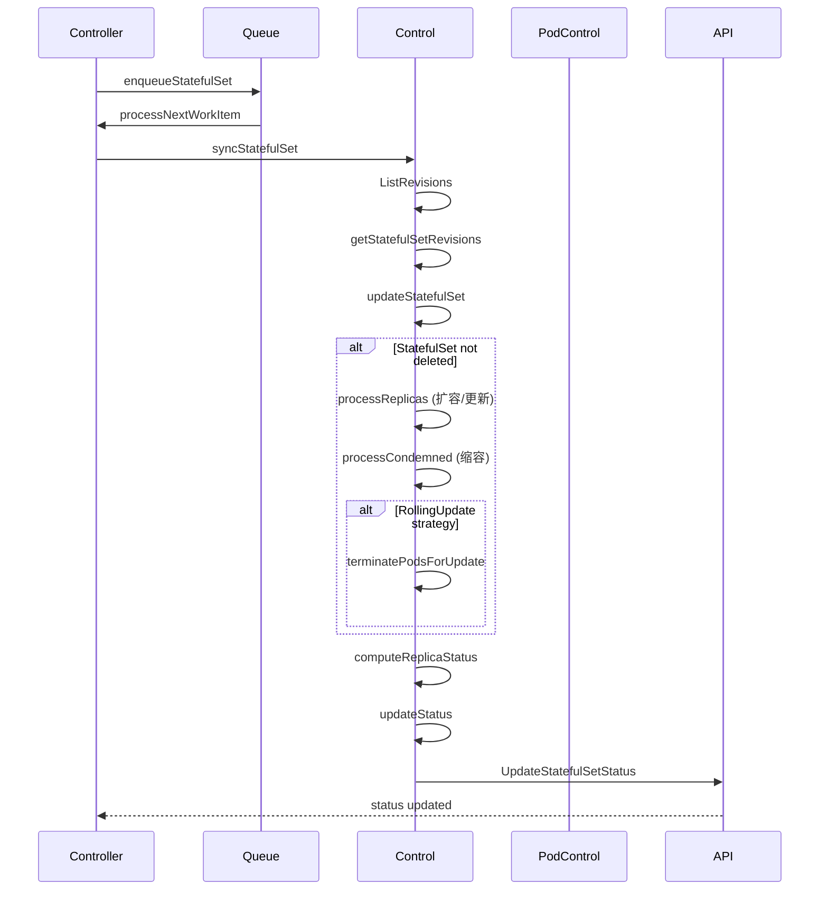
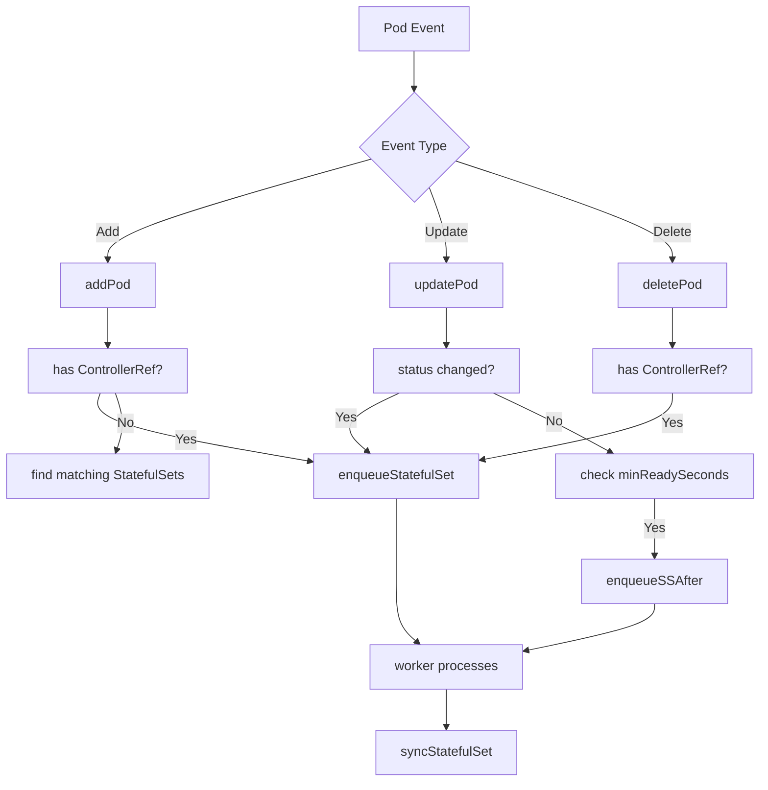

# Kubernetes StatefulSet Controller 源码深度分析

## 概述

### StatefulSet Controller 的职责和作用

StatefulSet Controller 是 Kubernetes 中负责管理有状态应用的核心控制器。它的主要职责包括：

1. **Pod 管理**：创建、更新和删除 Pod，确保 Pod 的数量符合期望副本数
2. **顺序编排**：按照固定的序号顺序创建和删除 Pod（从 0 开始）
3. **状态维护**：维护有状态应用的稳定网络标识和持久化存储
4. **滚动更新**：实现可控的滚动更新策略
5. **扩缩容处理**：处理应用的扩容和缩容操作
6. **PVC 管理**：管理 PersistentVolumeClaim 的生命周期

### 与 Deployment 的区别

| 特性 | Deployment | StatefulSet |
|------|------------|-------------|
| Pod 命名模式 | random-hash | app-name-ordinal |
| 网络标识 | 变化 | 稳定（固定 DNS 名称） |
| 存储策略 | 共享存储 | 独立持久化存储 |
| 更新策略 | 滚动更新、滚动回滚 | 滚动更新、分区更新、OnDelete |
| 删除顺序 | 任意顺序 | 从高序号到低序号 |
| 扩容顺序 | 并行创建 | 按序号顺序创建 |
| 适用场景 | 无状态应用 | 有状态应用（数据库、集群等） |

### 在 Kubernetes 架构中的位置

StatefulSet 位于 Kubernetes 控制平面中，作为 `kube-controller-manager` 的一个控制器运行。它的架构位置：

```
┌─────────────────────────────────────────────────────────────────┐
│                    Kubernetes Control Plane                      │
├─────────────────────────────────────────────────────────────────┤
│  kube-controller-manager                                      │
│  ┌─────────────┐  ┌─────────────┐  ┌─────────────┐          │
│  │  ReplicaSet  │  │ Deployment  │  │ StatefulSet │          │
│  │  Controller │  │  Controller │  │  Controller │          │
│  └─────────────┘  └─────────────┘  └─────────────┘          │
└─────────────────────────────────────────────────────────────────┘
                                │
                                ▼
┌─────────────────────────────────────────────────────────────────┐
│                      Kubernetes API                            │
│  ┌─────────────┐  ┌─────────────┐  ┌─────────────┐          │
│  │   Pods      │  │  PVCs       │  │ Services    │          │
│  └─────────────┘  └─────────────┘  └─────────────┘          │
└─────────────────────────────────────────────────────────────────┘
```

## 目录结构

```
pkg/controller/statefulset/
├── stateful_set.go              # 主控制器实现
├── stateful_set_control.go       # 核心控制逻辑
├── stateful_set_status_updater.go # 状态更新器
├── stateful_pod_control.go       # Pod 操作控制
├── stateful_set_utils.go         # 工具函数
├── metrics/metrics.go            # 指标收集
├── config/                       # 配置相关
├── *.go                          # 测试文件
```

### 关键文件说明

- **stateful_set.go**：主控制器入口，包含 StatefulSetController 结构定义和生命周期管理
- **stateful_set_control.go**：核心控制逻辑，实现了 UpdateStatefulSet 方法
- **stateful_pod_control.go**：Pod 和 PVC 的创建、更新、删除操作
- **stateful_set_utils.go**：工具函数，包含身份验证、存储匹配等辅助功能
- **stateful_set_status_updater.go**：负责更新 StatefulSet 的状态信息

## 核心机制

### 有状态标识管理

#### 1. 稳定的网络标识

StatefulSet 为每个 Pod 提供稳定的网络标识：

```go
// stateful_set_utils.go
func initIdentity(set *apps.StatefulSet, pod *v1.Pod) {
    updateIdentity(set, pod)
    // 设置固定的主机名和子域名
    pod.Spec.Hostname = pod.Name
    pod.Spec.Subdomain = set.Spec.ServiceName
}

func updateIdentity(set *apps.StatefulSet, pod *v1.Pod) {
    ordinal := getOrdinal(pod)
    pod.Name = getPodName(set, ordinal)
    pod.Namespace = set.Namespace
    if pod.Labels == nil {
        pod.Labels = make(map[string]string)
    }
    pod.Labels[apps.StatefulSetPodNameLabel] = pod.Name
    pod.Labels[apps.PodIndexLabel] = strconv.Itoa(ordinal)
}
```

Pod 命名格式：`<statefulset-name>-<ordinal>`
DNS 格式：`<pod-name>.<headless-service-name>.<namespace>.svc.cluster.local`

#### 2. 稳定的存储

StatefulSet 通过 VolumeClaimTemplates 为每个 Pod 创建独立的 PVC：

```go
// 生成 PVC 名称
func getPersistentVolumeClaimName(set *apps.StatefulSet, claim *v1.PersistentVolumeClaim, ordinal int) string {
    return fmt.Sprintf("%s-%s-%d", claim.Name, set.Name, ordinal)
}

// 检查存储是否匹配
func storageMatches(set *apps.StatefulSet, pod *v1.Pod) bool {
    ordinal := getOrdinal(pod)
    if ordinal < 0 {
        return false
    }
    volumes := make(map[string]v1.Volume, len(pod.Spec.Volumes))
    for _, volume := range pod.Spec.Volumes {
        volumes[volume.Name] = volume
    }
    for _, claim := range set.Spec.VolumeClaimTemplates {
        volume, found := volumes[claim.Name]
        if !found ||
            volume.VolumeSource.PersistentVolumeClaim == nil ||
            volume.VolumeSource.PersistentVolumeClaim.ClaimName !=
                getPersistentVolumeClaimName(set, &claim, ordinal) {
            return false
        }
    }
    return true
}
```

### Pod 创建顺序

StatefulSet 严格按照序号顺序创建 Pod：

```go
// stateful_set_control.go
// 检查是否可以创建下一个 Pod
func (ssc *defaultStatefulSetControl) processReplica(ctx context.Context, set *apps.StatefulSet, updateSet *apps.StatefulSet, monotonic bool, replicas []*v1.Pod, i int, now time.Time) (bool, error) {
    // 如果 Pod 未创建
    if !isCreated(replicas[i]) {
        // 在单调模式下，必须确保前面的 Pod 都已就绪
        if monotonic {
            // 检查所有前面的 Pod 是否都已就绪
            for j := 0; j < i; j++ {
                if !isRunningAndReady(replicas[j]) {
                    return true, nil // 等待前面的 Pod
                }
            }
        }
        // 创建 Pod
        if err := ssc.podControl.CreateStatefulPod(ctx, set, replicas[i]); err != nil {
            return true, err
        }
        if monotonic {
            return true, nil // 单调模式下，创建后立即返回
        }
    }
    // ...
}
```

### Pod 删除顺序

Pod 删除采用从高序号到低序号的顺序：

```go
// stateful_set_control.go
// 处理需要删除的 Pod
func (ssc *defaultStatefulSetControl) processCondemned(ctx context.Context, set *apps.StatefulSet, firstUnhealthyPod *v1.Pod, monotonic bool, condemned []*v1.Pod, i int, now time.Time) (bool, error) {
    // 在单调模式下，需要等待前面的 Pod 就绪才能删除当前 Pod
    if monotonic && condemned[i] != firstUnhealthyPod {
        if !isRunningAndReady(condemned[i]) {
            return true, nil // 等待 Pod 就绪
        }
    }
    
    // 删除 Pod
    logger.V(2).Info("Pod of StatefulSet is terminating for scale down",
        "statefulSet", klog.KObj(set), "pod", klog.KObj(condemned[i]))
    return true, ssc.podControl.DeleteStatefulPod(set, condemned[i])
}

// 对 condemned Pod 按降序排列
sort.Sort(descendingOrdinal(condemned))
```

### 滚动更新策略

StatefulSet 支持两种更新策略：

#### 1. RollingUpdate（默认）

```go
// stateful_set_control.go
// 处理滚动更新
func (ssc *defaultStatefulSetControl) updateStatefulSet(ctx context.Context, set *apps.StatefulSet, currentRevision *apps.ControllerRevision, updateRevision *apps.ControllerRevision, collisionCount int32, pods []*v1.Pod, now time.Time) (*apps.StatefulSetStatus, error) {
    // ...
    
    // 计算更新的最小序号
    updateMin := 0
    if set.Spec.UpdateStrategy.RollingUpdate != nil {
        updateMin = int(*set.Spec.UpdateStrategy.RollingUpdate.Partition)
    }
    
    // 从高序号开始删除，直到更新到 Partition 位置
    for target := len(replicas) - 1; target >= updateMin; target-- {
        // 删除不匹配更新版本的 Pod
        if getPodRevision(replicas[target]) != updateRevision.Name && !isTerminating(replicas[target]) {
            if err := ssc.podControl.DeleteStatefulPod(set, replicas[target]); err != nil {
                return &status, err
            }
            status.CurrentReplicas--
            return &status, err
        }
        
        // 等待 Pod 更新完成
        if isUnavailable(replicas[target], set.Spec.MinReadySeconds, now) {
            return &status, nil
        }
    }
    
    return &status, nil
}
```

#### 2. OnDelete

这种策略下，Pod 不会被自动更新，需要手动删除才会触发创建新 Pod。

#### 3. Partition

通过设置 `partition` 参数控制更新的 Pod 数量：

```yaml
spec:
  updateStrategy:
    type: RollingUpdate
    rollingUpdate:
      partition: 2  # 只更新序号大于等于 2 的 Pod
```

### 扩缩容机制

#### 扩容流程

1. 按序号顺序创建 Pod
2. 确保每个新 Pod 的所有前置 Pod 都已就绪
3. 创建 Pod 的 PVC（如果需要）

```go
// 扩容逻辑
func (ssc *defaultStatefulSetControl) processReplica(ctx context.Context, set *apps.StatefulSet, updateSet *apps.StatefulSet, monotonic bool, replicas []*v1.Pod, i int, now time.Time) (bool, error) {
    // 如果未创建则创建
    if !isCreated(replicas[i]) {
        // 检查 PVC 是否过期
        if isStale, err := ssc.podControl.PodClaimIsStale(set, replicas[i]); err != nil {
            return true, err
        } else if isStale {
            return true, err
        }
        // 创建 Pod
        if err := ssc.podControl.CreateStatefulPod(ctx, set, replicas[i]); err != nil {
            return true, err
        }
    }
    
    // 处理 pending 状态的 Pod（创建 PVC）
    if isPending(replicas[i]) {
        if err := ssc.podControl.createMissingPersistentVolumeClaims(ctx, set, replicas[i]); err != nil {
            return true, err
        }
    }
    
    // 等待 Pod 就绪
    if !isRunningAndReady(replicas[i]) && monotonic {
        return true, nil
    }
    
    return false, nil
}
```

#### 缩容流程

1. 从高序号开始删除 Pod
2. 确保删除的 Pod 已终止
3. 处理 PVC 的保留策略

### PVC 绑定管理

StatefulSet 通过 OwnerReference 管理 PVC 的所有权：

```go
// 更新 PVC 的 OwnerReference
func updateClaimOwnerRefForSetAndPod(logger klog.Logger, claim *v1.PersistentVolumeClaim, set *apps.StatefulSet, pod *v1.Pod) {
    refs := claim.GetOwnerReferences()
    
    // 清理旧的 OwnerReference
    refs = removeRefs(refs, func(ref *metav1.OwnerReference) bool {
        return matchesRef(ref, set, controllerKind) || matchesRef(ref, pod, podKind)
    })
    
    // 根据 PVC 保留策略添加新的 OwnerReference
    policy := getPersistentVolumeClaimRetentionPolicy(set)
    switch {
    case policy.WhenScaled == apps.RetainPersistentVolumeClaimRetentionPolicyType:
        // 缩容时保留，不添加 OwnerReference
    case policy.WhenScaled == apps.DeletePersistentVolumeClaimRetentionPolicyType:
        // 缩容时删除，将 OwnerReference 设置为 Pod
        podScaledDown := !podInOrdinalRange(pod, set)
        if podScaledDown {
            refs = addControllerRef(refs, pod, podKind)
        } else {
            refs = addControllerRef(refs, set, controllerKind)
        }
    }
    
    claim.SetOwnerReferences(refs)
}
```

## 核心数据结构

### StatefulSetController 结构

```go
// stateful_set.go
type StatefulSetController struct {
    // Kubernetes 客户端
    kubeClient clientset.Interface
    
    // 控制接口
    control StatefulSetControlInterface
    
    // Pod 控制器
    podControl controller.PodControlInterface
    
    // Pod 相关的 Lister 和 Indexer
    podIndexer cache.Indexer
    podLister corelisters.PodLister
    podListerSynced cache.InformerSynced
    
    // StatefulSet Lister
    setLister appslisters.StatefulSetLister
    setListerSynced cache.InformerSynced
    
    // PVC 和 ControllerRevision Lister
    pvcListerSynced cache.InformerSynced
    revListerSynced cache.InformerSynced
    
    // 任务队列
    queue workqueue.TypedRateLimitingInterface[string]
    
    // 事件广播器
    eventBroadcaster record.EventBroadcaster
    
    // 时钟
    clock clock.PassiveClock
    
    // 一致性存储
    consistencyStore consistencyutil.ConsistencyStore
}
```

### StatefulSetControlInterface

```go
// stateful_set_control.go
type StatefulSetControlInterface interface {
    // 更新 StatefulSet 的核心逻辑
    UpdateStatefulSet(ctx context.Context, set *apps.StatefulSet, pods []*v1.Pod, now time.Time) (*apps.StatefulSetStatus, error)
    
    // 列出所有版本历史
    ListRevisions(set *apps.StatefulSet) ([]*apps.ControllerRevision, error)
    
    // 收养孤立的 ControllerRevision
    AdoptOrphanRevisions(set *apps.StatefulSet, revisions []*apps.ControllerRevision) error
}
```

### replicaStatus 结构

```go
type replicaStatus struct {
    replicas          int32  // 总副本数
    readyReplicas     int32  // 就绪副本数
    availableReplicas int32  // 可用副本数
    currentReplicas   int32  // 当前版本副本数
    updatedReplicas   int32  // 更新版本副本数
}
```

## 工作流程

### syncStatefulSet 流程



### 事件处理流程



### 调谐循环

1. **事件触发**：Pod、StatefulSet、PVC 事件触发控制器
2. **队列处理**：工作线程从队列中获取 StatefulSet
3. **状态获取**：获取 StatefulSet 和关联的 Pod 列表
4. **版本管理**：管理 ControllerRevision 历史记录
5. **核心同步**：执行 updateStatefulSet 逻辑
6. **状态更新**：更新 StatefulSet 的状态信息
7. **重试处理**：失败时加入队列重试

## 关键代码片段

### 1. Pod 创建顺序控制

```go
// 在单调模式下必须等待前置 Pod 就绪
func (ssc *defaultStatefulSetControl) processReplica(ctx context.Context, set *apps.StatefulSet, updateSet *apps.StatefulSet, monotonic bool, replicas []*v1.Pod, i int, now time.Time) (bool, error) {
    // 确保所有前置 Pod 都已就绪
    if !isRunningAndReady(replicas[i]) && monotonic {
        logger.V(4).Info("StatefulSet is waiting for Pod to be Running and Ready",
            "statefulSet", klog.KObj(set), "pod", klog.KObj(replicas[i]))
        return true, nil // 等待前置 Pod
    }
    
    // 确保所有前置 Pod 都可用
    if !isRunningAndAvailable(replicas[i], set.Spec.MinReadySeconds, now) && monotonic {
        logger.V(4).Info("StatefulSet is waiting for Pod to be Available",
            "statefulSet", klog.KObj(set), "pod", klog.KObj(replicas[i]))
        return true, nil // 等待前置 Pod
    }
    
    // 执行实际操作
    // ...
}
```

### 2. 滚动更新实现

```go
// 实现滚动更新
func (ssc *defaultStatefulSetControl) updateStatefulSet(ctx context.Context, set *apps.StatefulSet, currentRevision *apps.ControllerRevision, updateRevision *apps.ControllerRevision, collisionCount int32, pods []*v1.Pod, now time.Time) (*apps.StatefulSetStatus, error) {
    // ...
    
    // 处理 OnDelete 策略
    if set.Spec.UpdateStrategy.Type == apps.OnDeleteStatefulSetStrategyType {
        return &status, nil
    }
    
    // 使用 MaxUnavailable 特性（如果启用）
    if utilfeature.DefaultFeatureGate.Enabled(features.MaxUnavailableStatefulSet) {
        return updateStatefulSetAfterInvariantEstablished(ctx, ssc, set, replicas, updateRevision, status, now)
    }
    
    // 传统滚动更新
    updateMin := 0
    if set.Spec.UpdateStrategy.RollingUpdate != nil {
        updateMin = int(*set.Spec.UpdateStrategy.RollingUpdate.Partition)
    }
    
    // 从高序号开始删除
    for target := len(replicas) - 1; target >= updateMin; target-- {
        if getPodRevision(replicas[target]) != updateRevision.Name && !isTerminating(replicas[target]) {
            logger.V(2).Info("Pod of StatefulSet is terminating for update",
                "statefulSet", klog.KObj(set), "pod", klog.KObj(replicas[target]))
            if err := ssc.podControl.DeleteStatefulPod(set, replicas[target]); err != nil {
                return &status, err
            }
            status.CurrentReplicas--
            return &status, err
        }
        
        // 等待 Pod 更新
        if isUnavailable(replicas[target], set.Spec.MinReadySeconds, now) {
            return &status, nil
        }
    }
    
    return &status, nil
}
```

### 3. 版本历史管理

```go
// 创建新版本
func (ssc *defaultStatefulSetControl) getStatefulSetRevisions(set *apps.StatefulSet, revisions []*apps.ControllerRevision) (*apps.ControllerRevision, *apps.ControllerRevision, int32, error) {
    // 创建新的 ControllerRevision
    updateRevision, err := newRevision(set, nextRevision(revisions), &collisionCount)
    if err != nil {
        return nil, nil, collisionCount, err
    }
    
    // 查找等效版本
    equalRevisions := history.FindEqualRevisions(revisions, updateRevision)
    
    if len(equalRevisions) > 0 && history.EqualRevision(revisions[len(revisions)-1], equalRevisions[len(equalRevisions)-1]) {
        // 使用最新的等效版本
        updateRevision = revisions[len(revisions)-1]
    } else if len(equalRevisions) > 0 {
        // 更新等效版本的 Revision
        updateRevision, err = ssc.controllerHistory.UpdateControllerRevision(
            equalRevisions[len(equalRevisions)-1],
            updateRevision.Revision)
    } else {
        // 创建新版本
        updateRevision, err = ssc.controllerHistory.CreateControllerRevision(set, updateRevision, &collisionCount)
    }
    
    // ...
}
```

### 4. PVC 保留策略实现

```go
// 检查 PVC 保留策略
func (spc *StatefulPodControl) ClaimsMatchRetentionPolicy(ctx context.Context, set *apps.StatefulSet, pod *v1.Pod) (bool, error) {
    ordinal := getOrdinal(pod)
    templates := set.Spec.VolumeClaimTemplates
    
    for i := range templates {
        claimName := getPersistentVolumeClaimName(set, &templates[i], ordinal)
        claim, err := spc.objectMgr.GetClaim(set.Namespace, claimName)
        
        switch {
        case apierrors.IsNotFound(err):
            // PVC 不存在，可能是正常状态
            continue
        case err != nil:
            return false, fmt.Errorf("Could not retrieve claim %s: %s", claimName, err)
        default:
            // 检查 OwnerReference 是否是最新的
            if !isClaimOwnerUpToDate(logger, claim, set, pod) {
                return false, nil
            }
        }
    }
    
    return true, nil
}
```

## 最佳实践建议

### 1. StatefulSet 设计原则

- **合理的副本数**：避免频繁扩缩容，有状态应用的维护成本较高
- **使用 Headless Service**：为每个 Pod 提供稳定的网络标识
- **正确配置 PVC**：根据应用需求配置存储大小和访问模式
- **设置 PodManagementPolicy**：根据应用特性选择 Ordered 或 Parallel

### 2. 更新策略选择

- **RollingUpdate with Partition**：生产环境推荐，可以分批更新
- **OnDelete**：用于需要手动控制更新节奏的场景
- **设置合理的 partition**：确保核心服务先更新，非核心服务后更新

### 3. 存储管理

- **使用 VolumeClaimTemplates**：避免手动管理 PVC
- **配置 RetentionPolicy**：根据业务需求决定删除 Pod 时是否保留 PVC
- **监控 PVC 使用情况**：避免存储不足导致 Pod 创建失败

### 4. 故障排查

- **查看 Pod 事件**：`kubectl describe pod <pod-name>`
- **检查 StatefulSet 状态**：`kubectl get statefulset <name> -o yaml`
- **查看 ControllerRevision**：`kubectl get controllerrevision -l app=<name>`
- **监控指标**：关注 `ready_replicas`、`updated_replicas` 等指标

### 5. 性能优化

- **合理设置 minReadySeconds**：避免应用未就绪就继续更新
- **使用并发处理**：对不依赖的 Pod 可以使用 Parallel 管理策略
- **避免频繁更新**：有状态应用的更新成本较高，尽量减少更新频率

### 6. 安全考虑

- **使用 RBAC**：限制 StatefulSet 的操作权限
- **Pod 安全策略**：确保 Pod 的安全性
- **存储安全**：配置适当的 PVC 访问权限

## 总结

StatefulSet Controller 是 Kubernetes 中最复杂的控制器之一，它通过精心设计的机制来管理有状态应用的生命周期。理解其工作原理对于运维有状态应用至关重要。

关键要点：
1. **顺序性**：Pod 的创建和删除都严格按照序号顺序进行
2. **稳定性**：提供稳定的网络标识和持久化存储
3. **可预测性**：更新和扩缩容的行为是可预测的
4. **灵活性**：支持多种更新策略和管理策略

通过深入理解 StatefulSet Controller 的源码，可以更好地排查问题、优化性能，并编写更可靠的有状态应用。
