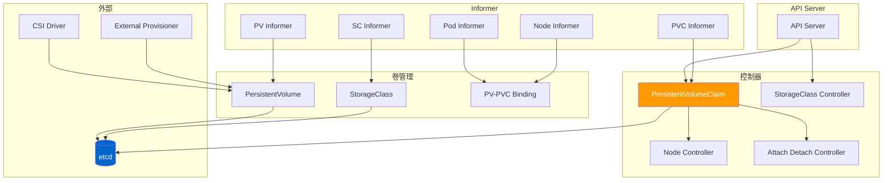
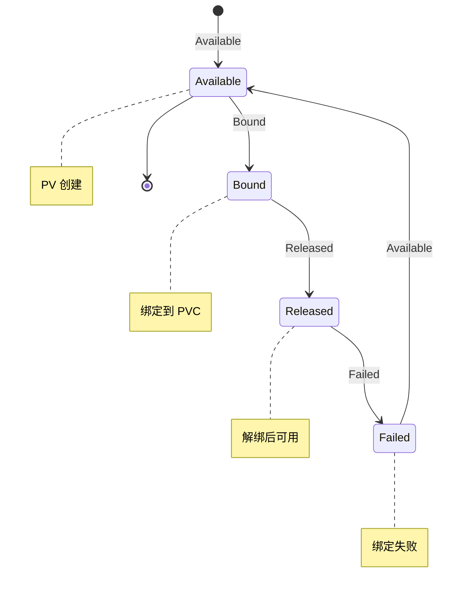
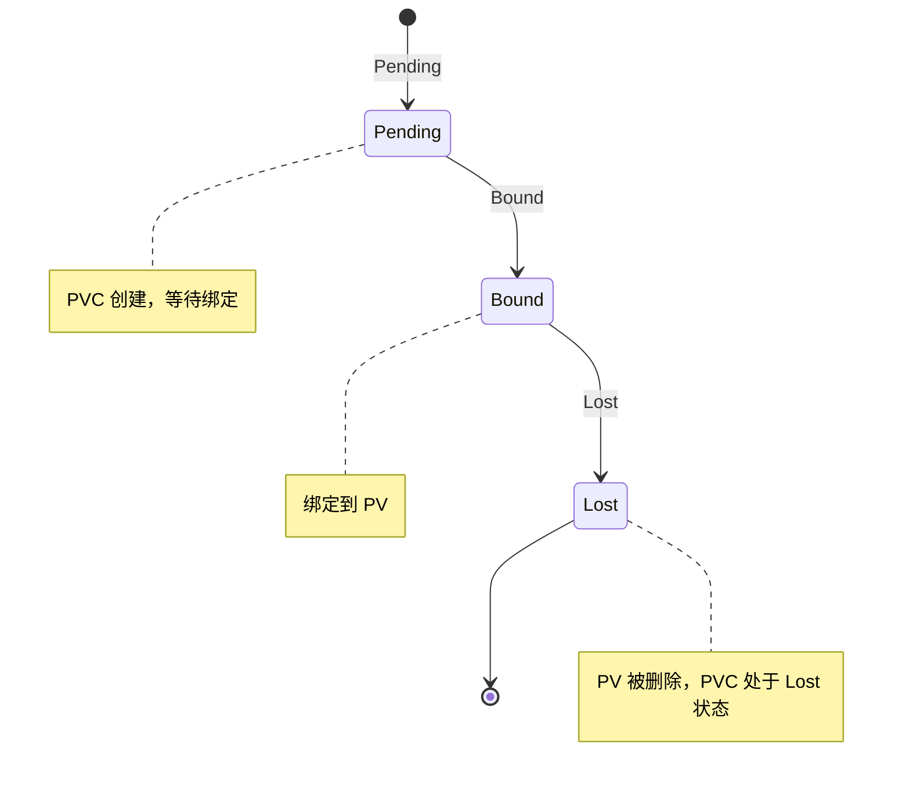
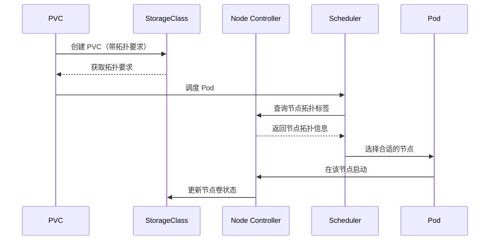

# Kubernetes 存储机制深度解析

## 概述

Kubernetes 的存储系统由多个协同的控制器组成，负责：
- PV（PersistentVolume）管理
- PVC（PersistentVolumeClaim）管理
- StorageClass 动态供应
- 卷挂载和卸载
- 拓扑感知调度
- 卷扩展（Volume Expansion）
- CSI（Container Storage Interface）驱动集成

本文档深入分析 Kubernetes 存储机制的架构、控制器实现、调度策略和扩展能力。

---

## 一、存储架构

### 1.1 整体架构



### 1.2 核心控制器

| 控制器 | 作用 | 位置 |
|---------|------|------|
| PersistentVolume Controller | 管理 PVs | `pkg/controller/volume/persistentvolume/` |
| PersistentVolumeClaim Controller | 管理 PVCs | `pkg/controller/volume/persistentvolume/` |
| StorageClass Controller | 管理 StorageClasses | `pkg/controller/volume/persistentvolume/` |
| Attach/Detach Controller | 管理卷挂载 | `pkg/controller/volume/persistentvolume/` |
| Node Controller | 更新 Node 卷状态 | `pkg/controller/node/` |

---

## 二、PersistentVolume Controller

### 2.1 PV Controller 结构

**文件：** `pkg/controller/volume/persistentvolume/pv_controller_base.go`

```go
type PVController struct {
    client     clientset.Interface

    pvLister   corelisters.PersistentVolumeLister
    pvcLister  corelisters.PersistentVolumeClaimLister

    volumePluginMgr vol.VolumePluginMgr

    volumeBindingBinder      *VolumeBinding

    claimQueue    workqueue.RateLimitingInterface[string]
    volumeQueue   workqueue.RateLimitingInterface[string]
}
```

### 2.2 PV 生命周期



**Phase 说明：**
- **Available**：PV 可用，等待绑定
- **Bound**：PV 已绑定到 PVC
- **Released**：PVC 删除后，PV 释放但未被回收
- **Failed**：绑定失败

### 2.3 PV 类型

#### 1. 静态 PV
```yaml
apiVersion: v1
kind: PersistentVolume
metadata:
  name: pv-001
spec:
  capacity:
    storage: 10Gi
  accessModes:
    - ReadWriteOnce
  persistentVolumeReclaimPolicy: Delete
  storageClassName: fast-ssd
  local:
    path: /mnt/data/disks/disk1
```

#### 2.2 网络存储
```yaml
apiVersion: v1
kind: PersistentVolume
metadata:
  name: nfs-pv
spec:
  capacity:
    storage: 100Gi
  accessModes:
    - ReadWriteMany
  nfs:
    server: 10.0.0.1
    path: /exports/data
```

#### 3. CSI PV
```yaml
apiVersion: v1
kind: PersistentVolume
metadata:
  name: csi-pv
spec:
  capacity:
    storage: 100Gi
  accessModes:
    - ReadWriteOnce
  csi:
    driver: com.example.csi-driver
    volumeHandle: vol-123
    fsType: ext4
```

---

## 三、PersistentVolumeClaim Controller

### 3.1 PVC Controller 结构

**文件：** `pkg/controller/volume/persistentvolume/pv_controller_base.go`

```go
type PVCController struct {
    client     clientset.Interface

    pvLister   corelisters.PersistentVolumeLister
    pvcLister  corelisters.PersistentVolumeClaimLister

    volumePluginMgr vol.VolumePluginMgr

    claimQueue   workqueue.RateLimitingInterface[string]
}
```

### 3.2 PVC 生命周期



**Phase 说明：**
- **Pending**：PVC 等待绑定
- **Bound**：PVC 已绑定到 PV
- **Lost**：PVC 对应的 PV 被删除

### 3.3 PVC 绑定流程

```go
func (c *PVCController) syncClaim(ctx context.Context, key string) error {
    // 1. 获取 PVC
    claim, err := c.pvcLister.PersistentVolumeClaims(namespace).Get(name)
    if errors.IsNotFound(err) {
        return nil
    }

    // 2. 获取相关的 PV
    pv, err := c.findBestMatchPV(claim)
    if err != nil {
        return err
    }

    // 3. 检查 PV 是否已绑定
    if pv.Spec.ClaimRef != nil && pv.Status.Phase != v1.VolumeAvailable {
        return fmt.Errorf("PV is not available")
    }

    // 4. 绑定 PVC 到 PV
    claim.Spec.VolumeName = pv.Name
    _, err = c.client.CoreV1().PersistentVolumeClaims(namespace).Update(ctx, claim, metav1.UpdateOptions{})
    if err != nil {
        return err
    }

    // 5. 更新 PV 状态
    pv.Status.Phase = v1.VolumeBound
    pv.Spec.ClaimRef = claim
    _, err = c.client.CoreV1().PersistentVolumes(namespace).Update(ctx, pv, metav1.UpdateOptions{})

    return nil
}
```

### 3.4 PVC 类型

#### 1. 访问模式（Access Modes）

| 模式 | 说明 |
|------|------|
| `ReadWriteOnce` | 卷可以被单个节点读写挂载 |
| `ReadOnlyMany` | 卷可以被多个节点只读挂载 |
| `ReadWriteMany` | 卷可以被多个节点读写挂载 |

#### 2. 存储类（StorageClass）

```yaml
apiVersion: v1
kind: PersistentVolumeClaim
metadata:
  name: my-pvc
spec:
  accessModes:
    - ReadWriteOnce
  resources:
    requests:
      storage: 10Gi
  storageClassName: fast-ssd
```

---

## 四、StorageClass 机制

### 4.1 StorageClass 概述

StorageClass 定义了存储的类型和参数：
- 描述存储提供商的类型（例如 AWS EBS、GCP PD、NFS）
- 定义供应策略
- 定义挂载选项
- 支持动态供应（Dynamic Provisioning）

### 4.2 StorageClass 类型定义

**文件：** `staging/src/k8s.io/api/storage/v1/types.go`

```go
type StorageClass struct {
    // Provisioner：存储供应商类型
    Provisioner string

    // Parameters：供应参数
    Parameters map[string]string

    // ReclaimPolicy：回收策略
    ReclaimPolicy *v1.PersistentVolumeReclaimPolicy

    // MountOptions：挂载选项
    MountOptions []string

    // VolumeBindingMode：绑定模式
    VolumeBindingMode *v1.VolumeBindingMode

    // AllowedTopologies：允许的拓扑
    AllowedTopologies []v1.TopologySelectorTerm
}
```

### 4.3 供应策略（Reclaim Policy）

| 策略 | 说明 |
|--------|------|
| `Retain` | PVC 删除后，PV 保留，数据需要手动清理 |
| `Delete` | PVC 删除后，PV 和数据都被删除 |
| `Recycle` |（已废弃）PV 执行数据擦除后可重新使用 |

### 4.4 StorageClass 示例

#### 1. AWS EBS
```yaml
apiVersion: storage.k8s.io/v1
kind: StorageClass
metadata:
  name: gp2
  annotations:
    storageclass.kubernetes.io/is-default-class: "true"
provisioner: kubernetes.io/aws-ebs
parameters:
  type: gp2
  fsType: ext4
  encrypted: "true"
reclaimPolicy: Delete
volumeBindingMode: WaitForFirstConsumer
allowedTopologies:
  - matchLabelExpressions:
      - key: topology.kubernetes.io/zone
        values:
          - us-east-1a
          - us-east-1b
```

#### 2. NFS
```yaml
apiVersion: storage.k8s.io/v1
kind: Controller
metadata:
  name: nfs-client
provisioner: example.com/nfs
parameters:
  server: 10.0.0.1
  path: /exports/data
reclaimPolicy: Delete
volumeBindingMode: Immediate
mountOptions:
  - nfsvers=4.2
```

---

## 五、PV-PVC 绑定机制

### 5.1 绑定控制器

**文件：** `pkg/controller/volume/persistentvolume/`

```go
type VolumeBinding struct {
    client        clientset.Interface

    pvLister     corelisters.PersistentVolumeLister
    pvcLister   corelisters.PersistentVolumeClaimLister
    podLister    corelisters.PodLister

    queue        workqueue.RateLimitingInterface[string]
}
```

### 5.2 绑定流程

```mermaid
sequenceDiagram
    participant User as 用户
    participant API as API Server
    participant PVC as PVC Controller
    participant PV as PV Controller
    participant Scheduler as Scheduler

    User->>API: 创建 PVC
    API->>PVC: PVC Controller 同步
    PVC->>Scheduler: 触发重新调度（拓扑感知）
    PVC->>PV: 查找合适的 PV
    alt 动态供应
        PV->>API: 通知外部供应器
        External-->>API: 创建 PV
    end
    else 静态 PV
        PV-->>API: 检查 PV 状态
        PV->>API: 返回可用的 PV
    end

    PV->>API: 绑定 PV 到 PVC
    PV->>API: 更新 PVC 状态
    API-->>PVC: PVC 状态更新
    PVC-->>API: 返回结果
    API-->>User: PVC 创建成功
```

### 5.3 动态供应流程

```go
func (vb *VolumeBinding) findBestMatchPV(claim *v1.PersistentVolumeClaim) (*v1.PersistentVolume, error) {
    // 1. 检查是否指定了 StorageClass
    if claim.Spec.StorageClassName == nil {
        // 2. 静态 PV：查找匹配的 PV
        return vb.findStaticPV(claim)
    }

    // 3. 动态 PV：触发供应
    return vb.provisionClaim(claim)
}

func (vb *VolumeBinding) provisionClaim(claim *v1.PersistentVolumeClaim) (*v1.PersistentVolume, error) {
    // 1. 获取 StorageClass
    storageClass, err := vb.storageClassLister.StorageClasses(claim.Spec.StorageClassName).Get(claim.Spec.StorageClassName)
    if err != nil {
        return nil, err
    }

    // 2. 调用 Provisioner 创建 PV
    provisioner := vb.volumePluginMgr.FindProvisionerByName(storageClass.Provisioner)

    pv, err := provisioner.Provision(context.TODO(), claim, storageClass)
    if err != nil {
        return nil, err
    }

    return pv, nil
}
```

---

## 六、卷挂载流程

### 6.1 卷挂载架构

```mermaid
graph TB
    subgraph "Pod"
        Pod[Pod]
        Containers[Containers]
    Volumes[Volumes]
    Mounts[Mounts]
    VolDev[Volume Devices]
    DevicePath[Device Paths]
    Env[Env Vars]
    Files[Files]
    Secret[Secrets]
    ConfigMap[ConfigMaps]
    DownwardAPI[Downward API]
    Projected[Projected Volumes]
        ServiceAccount[ServiceAccount Tokens]
    end

    subgraph "存储层"
        PV[PV]
        Secret[Secret]
        ConfigMap[ConfigMap]
        CSI[CSI Volume]
        EmptyDir[EmptyDir]
        HostPath[Host Path]
        NFS[NFS]
        GlusterFS[GlusterFS]
        RBD[RBD]
        FlexVolume[Flex Volume]
    end

    Containers --> Volumes --> Mounts --> VolDev
    Containers --> Env --> Secret
    Containers --> Files --> ConfigMap
    Containers --> DownwardAPI --> Projected
    Containers --> ServiceAccount
    Pod --> Volumes --> PV
    Pod --> Volumes --> Secret
    Pod --> Volumes --> ConfigMap
    Volumes --> CSI
    Volumes --> EmptyDir
    Volumes --> HostPath
    Volumes --> NFS

    style Pod fill:#ff9900,color:#fff
    style PV fill:#0066cc,color:#fff
```

### 6.2 卷挂载示例

#### 1. 块设备
```yaml
apiVersion: v1
kind: Pod
metadata:
  name: my-pod
spec:
  containers:
    - name: my-container
      volumeMounts:
        - name: data-volume
          mountPath: /data
          readOnly: false
  volumes:
    - name: data-volume
      persistentVolumeClaim:
        claimName: my-pvc
```

#### 2. Secret 挂载
```yaml
apiVersion: v1
kind: Pod
metadata:
  name: my-pod
spec:
  containers:
    - name: my-container
      env:
        - name: USERNAME
          valueFrom:
            secretKeyRef:
              name: my-secret
              key: username
        - name: PASSWORD
          valueFrom:
            secretKeyRef:
              name: my-secret
              key: password
  volumes:
    - name: secret-volume
      secret:
        secretName: my-secret
        defaultMode: 0400  # 设置文件权限
```

#### 3. HostPath 挂载
```yaml
apiVersion: v1
kind: Pod
metadata:
  name: my-pod
spec:
  containers:
    - name: my-container
      volumeMounts:
        - name: host-path-volume
          mountPath: /host/data
          readOnly: true
  volumes:
    - name: host-path-volume
      hostPath:
        path: /data/on/host
```

### 6.3 CSI 卷挂载流程

```go
func (d *volumePluginMgr) CanSupport(fsType string, spec *v1.VolumeSpec) (bool, *v1.Volume) error {
    // 1. 检查是否为 CSI 卷
    if spec.CSI != nil {
        // 2. 获取 CSI 驱动
        driver, err := d.getCSIDriver(spec.CSI.Driver)
        if err != nil {
            return false, err
        }

        // 3. 检查驱动是否支持
        if driver.NodeSupport(fsType, spec) {
            return true, nil
        }
    }

    return false, nil
}
```

---

## 七、拓扑感知调度

### 7.1 拓扑域

Kubernetes 支持多种拓扑域（Topology Domains）：
- **Node Labels**：节点标签，例如 `topology.kubernetes.io/zone=us-east-1`
- **Rack Labels**：机架标签
- **Zone Labels**：区域标签

### 7.2 拓扑感知调度流程



### 7.3 拓扑约束

```yaml
apiVersion: storage.k8s.io/v1
kind: StorageClass
metadata:
  name: zonal-storage
provisioner: kubernetes.io/aws-ebs
allowedTopologies:
  - matchLabelExpressions:
      - key: topology.kubernetes.io/zone
        values:
          - us-east-1
          - us-east-2
```

### 7.4 PVC 拓扑约束

```yaml
apiVersion: v1
kind: PersistentVolumeClaim
metadata:
  name: my-pvc
spec:
  accessModes:
    - ReadWriteOnce
  storageClassName: zonal-storage
  resources:
    requests:
      storage: 10Gi
  allowedTopologies:
    - matchLabelExpressions:
      - key: topology.kubernetes.io/zone
        values:
          - us-east-1
```

---

## 八、卷扩展（Volume Expansion）

### 8.1 卷扩容类型

#### 1. 在线扩容（Online Expansion）
- 扩容 PVC 时不需要删除 Pod
- 支持的文件系统：ext4、xfs

#### 2. 离线扩容（Offline Expansion）
- 需要删除 Pod 后才能扩容
- 支持所有文件系统

### 8.2 扩容流程

```mermaid
stateDiagram-v2
    [*] --> WaitForFirstConsumer: WaitForFirstConsumer
    WaitForFirstConsumer --> FileSystemResizePending: FileSystemResizePending
    FileSystemResizePending -> InProgress: InProgress
    InProgress --> ReadyForResize: ReadyForResize
    ReadyForResize -> ExpandFailed: ExpandFailed
    ExpandFailed --> [*]

    note right of WaitForFirstConsumer: 等待消费者准备
    note right of FileSystemResizePending: 文件系统调整大小
    note right of InProgress: 正在扩容
    note right of ReadyForResize: 文件系统已就绪，可以扩容
    note right of ExpandFailed: 扩容失败
```

### 8.3 StorageClass 扩容支持

```yaml
apiVersion: storage.k8s.io/v1
kind: StorageClass
metadata:
  name: expandable-storage
provisioner: kubernetes.io/aws-ebs
allowVolumeExpansion: true
```

---

## 九、CSI（Container Storage Interface）

### 9.1 CSI 架构

```mermaid
graph TB
    subgraph "K8s"
        K8s[K8s Node]
        Kubelet[Kubelet]
        Scheduler[Scheduler]
    end

    subgraph "CSI 驱动"
        Driver[CSI Driver]
        Plugin[CSI Plugin]
        Identity[CSI Identity]
        Controller[CSI Controller]
        Node[CSI Node]
    end

    subgraph "外部存储"
        Storage[External Storage]
    Network[Network Storage]
        API[Storage API]
    end

    K8s --> Kubelet --> Driver
    K8s --> Scheduler --> Controller
    K8s --> Identity

    Driver --> Plugin --> Storage
    Driver --> Plugin --> Network
    Driver --> Controller --> API

    style Driver fill:#ff9900,color:#fff
    style K8s fill:#0066cc,color:#fff
```

### 9.2 CSI 接口

#### 1. Identity Service
```go
// 获取插件信息
type IdentityServer interface {
    GetPluginInfo(ctx context.Context, req *csi.GetPluginInfoRequest) (*csi.GetPluginInfoResponse, error)
}
```

#### 2. Controller Service
```go
// 创建卷
type ControllerServer interface {
    CreateVolume(ctx context.Context, req *csi.CreateVolumeRequest) (*csi.CreateVolumeResponse, error)
    DeleteVolume(ctx context.Context, req *csi.DeleteVolumeRequest) (*csi.DeleteVolumeResponse, error)
}
```

#### 3. Node Service
```go
// 挂载/卸载卷
type NodeServer interface {
    NodePublishVolume(ctx context.Context, req *csi.NodePublishVolumeRequest) (*csi.NodePublishVolumeResponse, error)
    NodeUnpublishVolume(ctx context.Context, req *csi.NodeUnpublishVolumeRequest) (*csi.NodeUnpublishVolumeResponse, error)
}
```

### 9.3 CSI 驱动注册

```go
// 注册 CSI 驱动
func (m *CSIDriver) Run() error {
    // 1. 加载驱动
    driver, err := m.loadDriver()
    if err != nil {
        return err
    }

    // 2. 获取驱动信息
    info, err := driver.GetPluginInfo(context.TODO(), &csi.GetPluginInfoRequest{})
    if err != nil {
        return err
    }

    // 3. 注册到 Kubelet
    if err := m.registerDriver(info); err != nil {
        return err
    }

    return nil
}
```

---

## 十、关键代码路径

### 10.1 PV/PVC Controller
```
pkg/controller/volume/persistentvolume/
├── pv_controller_base.go            # PV Controller 基础
├── pv_controller.go                   # PV Controller 主逻辑
├── pvc_controller.go                 # PVC Controller 主逻辑
├── pv_controller_base.go               # 绑定逻辑
├── provision.go                        # 供应逻辑
├── cache.go                            # 卷缓存
└── metrics.go                          # 指标
```

### 10.2 StorageClass Controller
```
pkg/controller/volume/persistentvolume/
├── storageclass.go                     # StorageClass Controller
└── storageclass_controller.go        # StorageClass Controller
```

### 10.3 CSI 相关
```
pkg/volume/csimigration/
├── csimigration.go                     # CSI 迁移工具
└── csimigration_controller.go         # CSI 迁移控制器
```

---

## 十一、最佳实践

### 11.1 PV/PVC 管理

1. **使用 StorageClass**
   - 推荐动态供应
   - 避免手动管理 PV

2. **设置合适的 Reclaim Policy**
   - 生产环境推荐 `Delete`
   - `Retain` 需要手动清理

3. **使用访问模式**
   - `ReadWriteOnce`：单节点挂载
   - `ReadWriteMany`：多节点共享

4. **监控卷使用**
   ```bash
   kubectl get pv,pvc --all-namespaces
   kubectl top pod --containers
   ```

### 11.2 拓扑感知调度

1. **配置节点拓扑标签**
   ```bash
   kubectl label nodes <node-name> topology.kubernetes.io/zone=us-east-1
   ```

2. **使用 StorageClass 的拓扑约束**
   - 定义 `allowedTopologies`
   - 确保 Pod 在指定拓扑域

3. **使用 Pod 拓扑约束**
   - 配置 `allowedTopologies`
   - 匹配应用的拓扑需求

### 11.3 CSI 最佳实践

1. **使用 CSI 驱动**
   - 不要使用 in-tree 插件
   - 使用最新的 CSI 驱动

2. **配置 CSI 参数**
   - 根据存储供应商调整参数
   - 启用卷扩展（`allowVolumeExpansion`）

3. **监控 CSI 指标**
   - 监控卷操作延迟
   - 监控供应失败率

---

## 十二、故障排查

### 12.1 常见问题

#### 1. PVC 一直处于 Pending
**症状：** `PVC Status = Pending`

**排查：**
- 检查 StorageClass 是否存在
- 检查是否有合适的 PV
- 检查是否满足拓扑约束
- 查看事件：`kubectl describe pvc <pvc-name>`

#### 2. 卷挂载失败
**症状：** `ContainerCreating` 或 `MountFailed`

**排查：**
- 检查 CSI 驱动状态
- 检查 Node 的卷状态：`kubectl describe node <node-name>`
- 检查 PVC 绑定状态

#### 3. 扩容失败
**症状：** `FileSystemResizePending` → `ExpandFailed`

**排查：**
- 检查 StorageClass 是否支持扩容
- 检查 CSI 驱动是否实现扩容
- 查看事件：`kubectl describe pvc <pvc-name>`

### 12.2 调试技巧

1. **检查 PV/PVC 状态**
   ```bash
   kubectl get pv,pvc -o wide
   kubectl describe pvc <pvc-name>
   ```

2. **检查节点卷信息**
   ```bash
   kubectl get nodes -o custom-columns=NAME,.VOLUMES.ATTACHED,.VOLUMES.INUSE
   ```

3. **检查 StorageClass**
   ```bash
   kubectl get sc
   kubectl describe sc <storageclass-name>
   ```

4. **查看卷事件**
   ```bash
   kubectl get events --field-selector reason=FailedBinding
   ```

---

## 十三、总结

### 13.1 存储架构特点

1. **多层控制器**：PV/PVC/StorageClass 独立但协同工作
2. **动态供应**：StorageClass + Provisioner 自动创建 PV
3. **拓扑感知**：支持节点/区域/机架级别的调度约束
4. **卷扩展**：在线和离线扩容支持
5. **CSI 架构**：统一存储接口，支持多种存储后端

### 13.2 关键流程

1. **PVC 绑定流程**：PVC → 匹配 PV → 绑定 → 状态更新
2. **动态供应流程**：PVC + StorageClass → Provisioner → PV → 绑定
3. **卷挂载流程**：Pod → Volume → CSI 驱动 → 挂载
4. **扩容流程**：PVC 扩容请求 → CSI 调整 → 文件系统扩容

### 13.3 扩展点

1. **自定义 Provisioner**：实现 CSI 接口
2. **外部存储集成**：与云存储或 NFS 集成
3. **自定义 StorageClass**：优化供应策略
4. **高级拓扑域**：多层拓扑感知调度

---

## 参考资源

- [Kubernetes 存储文档](https://kubernetes.io/docs/concepts/storage/persistent-volumes/)
- [CSI 文档](https://kubernetes.io/docs/concepts/storage/volumes/)
- [Kubernetes CSI 规范](https://github.com/container-storage-interface/spec)
- [Kubernetes 存储代码](https://github.com/kubernetes/kubernetes/tree/master/pkg/controller/volume)
- [Kubernetes 存储设计文档](https://github.com/kubernetes/community/blob/master/contributors/design-proposals)

---

**文档版本**：v1.0
**最后更新**：2026-03-03
**分析范围**：Kubernetes v1.x
