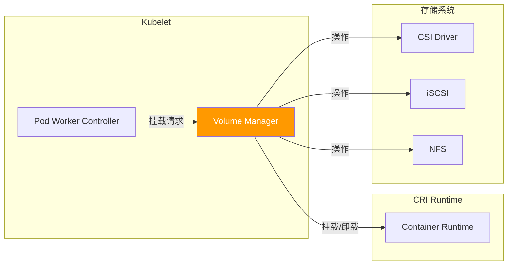
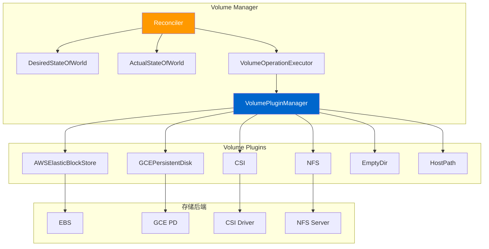
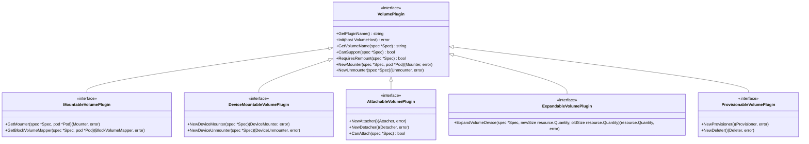
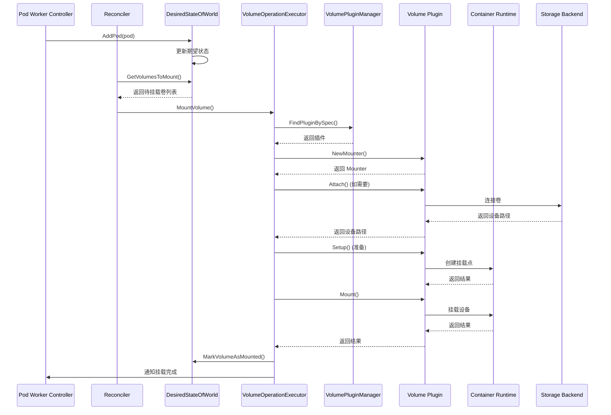
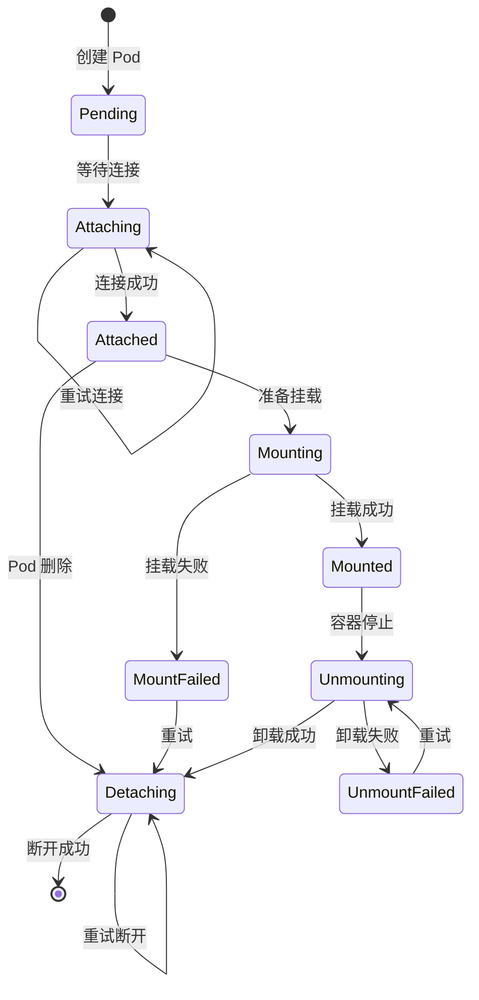

# Volume Manager 深度分析

> 本文档深入分析 Kubernetes 的 Volume Manager，包括卷管理接口、挂载流程、卷类型处理、生命周期管理、指标收集和最佳实践。

---

## 目录

1. [Volume Manager 概述](#volume-manager-概述)
2. [Volume Manager 架构](#volume-manager-架构)
3. [卷管理接口](#卷管理接口)
4. [卷挂载流程](#卷挂载流程)
5. [卷类型处理](#卷类型处理)
6. [卷生命周期管理](#卷生命周期管理)
7. [卷指标收集](#卷指标收集)
8. [卷清理和回收](#卷清理和回收)
9. [性能优化](#性能优化)
10. [故障排查](#故障排查)
11. [最佳实践](#最佳实践)

---

## Volume Manager 概述

### Volume Manager 的作用

Volume Manager 是 Kubelet 中负责管理 Pod 存储卷的核心组件：



### Volume Manager 的职责

| 职责 | 说明 |
|------|------|
| **卷发现** | 发现和管理可用卷设备 |
| **卷挂载** | 将卷挂载到节点或容器 |
| **卷卸载** | 安全卸载不再使用的卷 |
| **卷清理** | 清理和回收卷资源 |
| **状态跟踪** | 跟踪卷的挂载状态和健康状态 |
| **指标收集** | 收集和暴露卷相关指标 |
| **卷热插拔** | 支持动态添加/移除卷 |

### Volume Manager 的价值

- **统一接口**：为不同卷类型提供统一的管理接口
- **生命周期管理**：自动化卷的挂载、卸载和清理
- **可靠性**：确保卷操作的正确性和幂等性
- **性能优化**：优化卷挂载/卸载性能
- **可扩展性**：支持通过 CSI 添加新卷类型

---

## Volume Manager 架构

### 整体架构



### 核心组件

#### 1. Reconciler（协调器）

**位置**：`pkg/kubelet/volumemanager/reconciler/reconciler.go`

Reconciler 是 Volume Manager 的核心协调器，负责：

- 比较 DesiredStateOfWorld 和 ActualStateOfWorld
- 触发挂载/卸载操作
- 处理并发和重试逻辑

```go
// Reconciler 接口定义
type Reconciler interface {
    // Run 启动协调循环
    Run(sourcesReady config.SourcesReady, stopCh <-chan struct{})

    // Sync 执行一次协调
    Sync()
}
```

#### 2. DesiredStateOfWorld（期望状态）

**位置**：`pkg/kubelet/volumemanager/cache/desired_state_of_world.go`

DesiredStateOfWorld 保存了 Pod 和卷的期望状态：

```go
// DesiredStateOfWorld 接口定义
type DesiredStateOfWorld interface {
    // AddPod 添加 Pod 和其卷到期望状态
    AddPod(pod *v1.Pod)

    // RemovePod 从期望状态移除 Pod
    RemovePod(podName types.UID) error

    // PodsToSync 返回需要同步的 Pod 列表
    PodsToSync() []*v1.Pod
}
```

**数据结构**：

```go
type VolumeMap map[uniquePodName]map[v1.UniqueVolumeName]volumeToMount

type volumeToMount struct {
    PodName             uniquePodName
    VolumeSpec          *volume.Spec
    OuterVolumeSpecName string
    Pod                 *v1.Pod
    VolumeGidValue      string
}
```

#### 3. ActualStateOfWorld（实际状态）

**位置**：`pkg/kubelet/volumemanager/cache/actual_state_of_world.go`

ActualStateOfWorld 保存了卷的实际挂载状态：

```go
// ActualStateOfWorld 接口定义
type ActualStateOfWorld interface {
    // MarkVolumeAsMounted 标记卷为已挂载
    MarkVolumeAsMounted(volumeName v1.UniqueVolumeName, podName uniquePodName)

    // MarkVolumeAsUnmounted 标记卷为已卸载
    MarkVolumeAsUnmounted(volumeName v1.UniqueVolumeName)

    // MarkVolumeAsAttached 标记卷为已连接
    MarkVolumeAsAttached(volumeName v1.UniqueVolumeName, nodeName types.NodeName)
}
```

**数据结构**：

```go
type mountedVolume struct {
    volumeName       v1.UniqueVolumeName
    podName          uniquePodName
    volumeSpec       *volume.Spec
    outerVolumeSpecName string
    pluginName       string
    volumeGidValue   string
    mounter         volume.Mounter
    blockVolumeMapper volume.BlockVolumeMapper
}
```

#### 4. VolumeOperationExecutor（操作执行器）

**位置**：`pkg/kubelet/volumemanager/reconciler/reconciler.go`

VolumeOperationExecutor 执行实际的卷操作：

```go
// VolumeOperationExecutor 接口定义
type VolumeOperationExecutor interface {
    // VerifyVolumesAreAttached 验证卷是否已连接
    VerifyVolumesAreAttached(volumesAttachedCheck []*v1.Volume, nodeName types.NodeName) (map[v1.UniqueVolumeName]bool, error)

    // MountVolume 挂载卷
    MountVolume(volumeToMount VolumeToMount, volumeGidValue string, pod *v1.Pod) (volume.Mounter, error)

    // UnmountVolume 卸载卷
    UnmountVolume(volumeToUnmount VolumeToUnmount) error

    // AttachVolume 连接卷
    AttachVolume(volumeToAttach VolumeToAttach, actualStateOfWorld ActualStateOfWorld) error

    // DetachVolume 断开卷
    DetachVolume(volumeToDetach VolumeToDetach, actualStateOfWorld ActualStateOfWorld) error
}
```

#### 5. VolumePluginManager（插件管理器）

**位置**：`pkg/kubelet/volumemanager/volume_plugin.go`

VolumePluginManager 管理所有卷插件：

```go
// VolumePluginManager 接口定义
type VolumePluginManager interface {
    // FindPluginBySpec 根据卷规范查找插件
    FindPluginBySpec(spec *volume.Spec) (volume.VolumePlugin, error)

    // FindPluginByName 根据插件名称查找插件
    FindPluginByName(name string) volume.VolumePlugin

    // FindCreatablePluginBySpec 查找可创建卷的插件
    FindCreatablePluginBySpec(spec *volume.Spec) (volume.CreatableVolumePlugin, error)

    // ListPlugins 列出所有插件
    ListPlugins() []volume.VolumePlugin
}
```

---

## 卷管理接口

### 卷接口层次



### 核心接口

#### 1. VolumePlugin 接口

**位置**：`pkg/volume/volume.go`

```go
// VolumePlugin 是所有卷插件的基础接口
type VolumePlugin interface {
    // GetPluginName 返回插件名称
    GetPluginName() string

    // Init 初始化插件
    Init(host VolumeHost) error

    // GetVolumeName 返回卷的唯一名称
    GetVolumeName(spec *Spec) string

    // CanSupport 判断是否支持该卷类型
    CanSupport(spec *Spec) bool

    // RequiresRemount 判断是否需要重新挂载
    RequiresRemount(spec *Spec) bool

    // NewMounter 创建 Mounter
    NewMounter(spec *Spec, pod *Pod) (Mounter, error)

    // NewUnmounter 创建 Unmounter
    NewUnmounter(spec *Spec) (Unmounter, error)

    // ConstructVolumeSpec 构建卷规范
    ConstructVolumeSpec(volumeName, volumePath string) (ReconstructedVolume, error)

    // SupportsMountOption 判断是否支持挂载选项
    SupportsMountOption() bool

    // SupportsBulkVolumeVerification 判断是否支持批量验证
    SupportsBulkVolumeVerification() bool

    // RequiresFSResize 判断是否需要文件系统调整大小
    RequiresFSResize() bool
}
```

#### 2. Mounter 接口

**位置**：`pkg/volume/volume.go`

```go
// Mounter 负责将卷挂载到容器中
type Mounter interface {
    // Mount 将卷挂载到指定目录
    Mount(device string, targetPath string, opts volume.MountOptions) error

    // Setup 挂载卷前准备
    Setup(mounterArgs MounterArgs) error

    // GetAttributes 返回卷属性
    GetAttributes() (Attributes, error)

    // CanMount 判断是否可以挂载
    CanMount() error
}
```

**MountOptions 结构**：

```go
// MountOptions 挂载选项
type MountOptions struct {
    // 挂载选项
    FsType             string
    Mounter            string
    Mountflags          []string
    Fsoptions          []string
    BlockVolumeMapper  BlockVolumeMapper
    MntnsInfo          *mount.MountInfo
    RemountOptions     []string
}
```

#### 3. Unmounter 接口

**位置**：`pkg/volume/volume.go`

```go
// Unmounter 负责卸载卷
type Unmounter interface {
    // TearDown 卸载卷前清理
    TearDown(mounterArgs UnmounterArgs) error

    // Unmount 卸载卷
    Unmount(target string) error
}
```

#### 4. Attacher 接口

**位置**：`pkg/volume/attachable.go`

```go
// Attacher 负责将卷连接到节点
type Attacher interface {
    // Attach 将卷连接到节点
    Attach(spec *Spec, nodeName types.NodeName) (string, error)

    // VolumesAreAttached 检查卷是否已连接
    VolumesAreAttached(specs []*Spec, nodeName types.NodeName) (map[VolumeName]bool, error)

    // WaitForAttach 等待卷连接完成
    WaitForAttach(spec *Spec, nodeName types.NodeName, pod *Pod) (string, error)

    // GetDeviceMountPath 获取设备挂载路径
    GetDeviceMountPath(spec *Spec) (string, error)
}
```

#### 5. Detacher 接口

**位置**：`pkg/volume/attachable.go`

```go
// Detacher 负责从节点断开卷
type Detacher interface {
    // Detach 从节点断开卷
    Detach(volumeName string, nodeName types.NodeName) error

    // UnmountDevice 卸载设备
    UnmountDevice(devicePath string) error
}
```

---

## 卷挂载流程

### 完整挂载流程



### 代码实现

#### 1. Reconciler 主循环

**位置**：`pkg/kubelet/volumemanager/reconciler/reconciler.go`

```go
// Run 启动协调循环
func (rc *reconciler) Run(sourcesReady config.SourcesReady, stopCh <-chan struct{}) {
    wait.Until(func() {
        rc.reconcile()
    }, rc.syncPeriod, stopCh)
}

// reconcile 执行一次协调
func (rc *reconciler) reconcile() {
    // 1. 挂载期望状态中的卷
    rc.syncLoopIteration()

    // 2. 卸载不再需要的卷
    rc.unmountVolumes()
}
```

#### 2. 挂载卷

**位置**：`pkg/kubelet/volumemanager/reconciler/reconciler.go`

```go
// MountVolume 挂载卷到节点和容器
func (oe *operationExecutor) MountVolume(
    waitForAttachTimeout time.Duration,
    volumeToMount VolumeToMount,
    actualStateOfWorld ActualStateOfWorld) (volume.Mounter, error) {

    // 1. 检查卷是否已连接
    attachDetachedVolume := false
    plugin, err := oe.pluginMgr.FindPluginBySpec(volumeToMount.VolumeSpec)
    if err != nil {
        return nil, err
    }

    // 2. 检查是否需要连接（AttachableVolumePlugin）
    if attachablePlugin, ok := plugin.(volume.AttachableVolumePlugin); ok {
        devicePath, err := oe.attachAndMountDevice(
            attachablePlugin,
            volumeToMount,
            actualStateOfWorld,
            waitForAttachTimeout)
        if err != nil {
            return nil, err
        }
        attachDetachedVolume = true
    }

    // 3. 创建 Mounter
    mounter, err := plugin.NewMounter(volumeToMount.VolumeSpec, volumeToMount.Pod)
    if err != nil {
        return nil, err
    }

    // 4. 执行挂载
    mountErr := mounter.SetUp(volumeToMount.MounterArgs)
    if mountErr != nil {
        return nil, mountErr
    }

    // 5. 更新实际状态
    actualStateOfWorld.MarkVolumeAsMounted(
        volumeToMount.VolumeName,
        volumeToMount.PodName)

    return mounter, nil
}
```

#### 3. 连接卷（Attach）

**位置**：`pkg/kubelet/volumemanager/reconciler/reconciler.go`

```go
// attachAndMountDevice 连接并挂载设备
func (oe *operationExecutor) attachAndMountDevice(
    attachablePlugin volume.AttachableVolumePlugin,
    volumeToMount VolumeToMount,
    actualStateOfWorld ActualStateOfWorld,
    waitForAttachTimeout time.Duration) (string, error) {

    // 1. 创建 Attacher
    attacher, err := attachablePlugin.NewAttacher()
    if err != nil {
        return "", err
    }

    // 2. 执行连接操作
    devicePath, err := oe.attacherDetacher.AttachVolume(
        volumeToAttach, actualStateOfWorld, waitForAttachTimeout)
    if err != nil {
        return "", err
    }

    // 3. 挂载设备到全局挂载点
    deviceMountPath, err := oe.getDeviceMountPath(volumeToMount.VolumeSpec)
    if err != nil {
        return "", err
    }

    err = oe.mountDeviceToGlobalPath(
        attacher,
        devicePath,
        deviceMountPath,
        volumeToMount)
    if err != nil {
        return "", err
    }

    return deviceMountPath, nil
}
```

#### 4. 挂载到容器

**位置**：`pkg/volume/util/hostutil/hostutil_linux.go`

```go
// Mount 挂载设备到目标路径
func (hu *HostUtil) Mount(source string, target string, fstype string, options []string) error {
    // 1. 检查目标路径是否存在
    if _, err := os.Stat(target); os.IsNotExist(err) {
        if err := os.MkdirAll(target, 0750); err != nil {
            return err
        }
    }

    // 2. 执行挂载
    mountArgs := []string{"-t", fstype}
    mountArgs = append(mountArgs, options...)
    mountArgs = append(mountArgs, source, target)

    exec.Command("mount", mountArgs...).Run()

    return nil
}
```

---

## 卷类型处理

### 支持的卷类型

```mermaid
graph TB
    subgraph "Volume Plugins"
        CSICSI[CSI Driver]
        AWSEBS[AWS EBS]
        GCEPD[GCE PD]
        AzureDisk[Azure Disk]
        AzureFile[Azure File]
        NFS[NFS]
        ISCSI[iSCSI]
        FC[Fibre Channel]
        Glusterfs[GlusterFS]
        CephRBD[Ceph RBD]
        CephFS[CephFS]
        EmptyDir[EmptyDir]
        HostPath[HostPath]
        ConfigMap[ConfigMap]
        Secret[Secret]
        Downward[Downward API]
        Projected[Projected]
    end

    subgraph "外部存储"
        AWS[AWS EC2]
        GCP[Google Cloud]
        Azure[Azure Storage]
        NFSV[NFS Server]
        ISCSIV[iSCSI Target]
        FCV[FC Switch]
    end

    AWSEBS --> AWS
    GCEPD --> GCP
    AzureDisk --> Azure
    AzureFile --> Azure
    NFS --> NFSV
    ISCSI --> ISCSIV
    FC --> FCV

    style CSICSI fill:#ff9900,color:#fff
```



### 常见卷类型详解

#### 1. EmptyDir

EmptyDir 是最简单的卷类型，Pod 内的容器共享数据：

**特点**：
- Pod 创建时自动创建
- Pod 删除时自动删除
- 同 Pod 内的所有容器共享

**源码位置**：`pkg/volume/empty_dir/empty_dir.go`

```go
// emptyDir EmptyDir 卷插件
type emptyDir struct {
    plugin *emptyDirPlugin
    podUID string
    volumeName string
    medium string
}

// SetUp 创建 EmptyDir
func (ed *emptyDir) SetUp(mounterArgs volume.MounterArgs) error {
    // 1. 创建临时目录
    dir, err := ed.plugin.host.GetPodVolumeDir(
        ed.podUID, ed.volumeName)
    if err != nil {
        return err
    }

    // 2. 设置权限
    if err := os.MkdirAll(dir, 0750); err != nil {
        return err
    }

    // 3. 如果指定了 medium=memory，使用 tmpfs
    if ed.medium == "memory" {
        mountArgs := []string{"-t", "tmpfs", "tmpfs", dir}
        exec.Command("mount", mountArgs...).Run()
    }

    return nil
}
```

**使用示例**：

```yaml
apiVersion: v1
kind: Pod
metadata:
  name: emptydir-pod
spec:
  containers:
  - name: container-1
    image: nginx
    volumeMounts:
    - name: cache
      mountPath: /cache
  - name: container-2
    image: busybox
    command: ["/bin/sh", "-c", "echo Hello > /cache/data"]
    volumeMounts:
    - name: cache
      mountPath: /cache
  volumes:
  - name: cache
    emptyDir:
      medium: Memory  # 使用内存存储
      sizeLimit: 1Gi  # 大小限制
```

#### 2. HostPath

HostPath 挂载节点上的文件或目录到 Pod：

**特点**：
- 挂载节点上的文件系统
- 适合调试和日志收集
- 有安全风险（仅用于测试）

**源码位置**：`pkg/volume/host_path/host_path.go`

```go
// hostPath HostPath 卷插件
type hostPath struct {
    plugin *hostPathPlugin
    podUID string
    volumeName string
    path string
    readOnly bool
}

// SetUp 挂载 HostPath
func (hp *hostPath) SetUp(mounterArgs volume.MounterArgs) error {
    // 1. 检查路径是否存在
    if _, err := os.Stat(hp.path); os.IsNotExist(err) {
        return fmt.Errorf("hostPath type check failed: %s does not exist", hp.path)
    }

    // 2. 创建绑定挂载
    bindMountOpts := []string{
        fmt.Sprintf("%s:%s", hp.path, mounterArgs.MountPath),
        "rw",
    }

    if hp.readOnly {
        bindMountOpts[1] = "ro"
    }

    exec.Command("mount", "--bind", bindMountOpts...).Run()

    return nil
}
```

**使用示例**：

```yaml
apiVersion: v1
kind: Pod
metadata:
  name: hostpath-pod
spec:
  containers:
  - name: container
    image: busybox
    command: ["/bin/sh", "-c", "cat /var/log/syslog"]
    volumeMounts:
    - name: host-logs
      mountPath: /var/log
      readOnly: true
  volumes:
  - name: host-logs
    hostPath:
      path: /var/log
      type: DirectoryOrCreate  # 如果不存在则创建
```

#### 3. NFS

NFS 卷允许挂载网络文件系统：

**特点**：
- 支持多节点同时挂载
- 适合共享数据
- 需要 NFS 服务器

**源码位置**：`pkg/volume/nfs/nfs.go`

```go
// nfs NFS 卷插件
type nfs struct {
    plugin *nfsPlugin
    podUID types.UID
    volumeName v1.UniqueVolumeName
    server string
    path string
    readOnly bool
}

// SetUp 挂载 NFS
func (n *nfs) SetUp(mounterArgs volume.MounterArgs) error {
    // 1. 构建 NFS 源路径
    source := fmt.Sprintf("%s:%s", n.server, n.path)

    // 2. 执行挂载
    mountArgs := []string{
        "-t", "nfs",
        source,
        mounterArgs.MountPath,
    }

    if n.readOnly {
        mountArgs = append(mountArgs, "ro")
    }

    exec.Command("mount", mountArgs...).Run()

    return nil
}
```

**使用示例**：

```yaml
apiVersion: v1
kind: Pod
metadata:
  name: nfs-pod
spec:
  containers:
  - name: container
    image: nginx
    volumeMounts:
    - name: nfs-data
      mountPath: /usr/share/nginx/html
  volumes:
  - name: nfs-data
    nfs:
      server: 192.168.1.100  # NFS 服务器地址
      path: /exports/data     # NFS 导出路径
      readOnly: false
```

#### 4. CSI（Container Storage Interface）

CSI 是现代 Kubernetes 存储的标准接口：

**特点**：
- 统一的存储接口
- 支持动态供给
- 支持卷扩容
- 支持快照和克隆

**源码位置**：`pkg/volume/csi/csi_plugin.go`

```go
// csiPlugin CSI 卷插件
type csiPlugin struct {
    driverName string
    csiClient csi.Client
    host volume.VolumeHost
}

// SetUp 挂载 CSI 卷
func (c *csiPlugin) SetUp(mounterArgs volume.MounterArgs) error {
    // 1. 调用 CSI NodePublishVolume
    req := &csi.NodePublishVolumeRequest{
        VolumeId:          c.volumeID,
        TargetPath:        mounterArgs.MountPath,
        VolumeCapability:  c.volumeCapability,
        Readonly:          c.readOnly,
    }

    _, err := c.csiClient.NodePublishVolume(ctx, req)
    if err != nil {
        return err
    }

    return nil
}
```

**使用示例**：

```yaml
apiVersion: v1
kind: PersistentVolumeClaim
metadata:
  name: csi-pvc
spec:
  accessModes:
  - ReadWriteOnce
  storageClassName: csi-hostpath-sc
  resources:
    requests:
      storage: 1Gi
```

---

## 卷生命周期管理

### 生命周期状态机



### 生命周期事件

#### 1. Pod 创建事件

```go
// PodCreated 处理 Pod 创建事件
func (rcm *reconciler) PodCreated(pod *v1.Pod) {
    // 1. 添加 Pod 到期望状态
    rcm.desiredStateOfWorld.AddPod(pod)

    // 2. 触发协调
    rcm.reconcile()
}
```

#### 2. Pod 删除事件

```go
// PodDeleted 处理 Pod 删除事件
func (rcm *reconciler) PodDeleted(podName types.UID) {
    // 1. 从期望状态移除 Pod
    rcm.desiredStateOfWorld.RemovePod(podName)

    // 2. 触发协调
    rcm.reconcile()
}
```

#### 3. 卷挂载完成事件

```go
// VolumeMounted 处理卷挂载完成事件
func (rcm *reconciler) VolumeMounted(volumeName v1.UniqueVolumeName, podName uniquePodName) {
    // 1. 更新实际状态
    rcm.actualStateOfWorld.MarkVolumeAsMounted(volumeName, podName)

    // 2. 通知 Pod Worker
    rcm.volumeEventRecorder.Eventf(
        pod,
        v1.EventTypeNormal,
        "VolumeMounted",
        "Volume %s mounted successfully",
        volumeName)
}
```

---

## 卷指标收集

### 指标类型

```go
// VolumeMetrics 卷指标
type VolumeMetrics struct {
    // 可用空间
    Available int64

    // 已用空间
    Capacity int64

    // 已用空间
    Used int64

    // Inodes 可用数量
    Inodes int64

    // Inodes 已用数量
    InodesUsed int64

    // Inodes 总数
    InodesFree int64
}
```

### 指标收集实现

**位置**：`pkg/volume/metrics_du.go`

```go
// GetMetrics 收集卷指标
func (v *volumeMetrics) GetMetrics() (*VolumeMetrics, error) {
    // 1. 获取文件系统统计信息
    var stat syscall.Statfs_t
    err := syscall.Statfs(v.path, &stat)
    if err != nil {
        return nil, err
    }

    // 2. 计算指标
    blockSize := uint64(stat.Bsize)

    metrics := &VolumeMetrics{
        Available: int64(stat.Bavail * blockSize),
        Capacity:  int64(stat.Blocks * blockSize),
        Used:      int64((stat.Blocks - stat.Bfree) * blockSize),
        Inodes:    int64(stat.Files),
        InodesFree: int64(stat.Ffree),
        InodesUsed: int64(stat.Files - stat.Ffree),
    }

    return metrics, nil
}
```

### Prometheus 指标

**位置**：`pkg/volume/metrics_prometheus.go`

```go
// RecordVolumeOperation 记录卷操作指标
func (recorder *recorder) RecordVolumeOperation(operation string, pluginName string, duration time.Duration, err error) {
    labels := prometheus.Labels{
        "operation":  operation,
        "plugin":     pluginName,
        "status":     "success",
    }

    if err != nil {
        labels["status"] = "error"
    }

    volumeOperationsTotal.With(labels).Inc()
    volumeOperationsDuration.With(labels).Observe(duration.Seconds())
}
```

**暴露的指标**：

```yaml
# 卷操作总数
kubelet_volume_operations_total{operation="mount", plugin="aws_ebs", status="success"}

# 卷操作耗时
kubelet_volume_operations_duration_seconds{operation="mount", plugin="aws_ebs", status="success"}

# 卷挂载失败数
kubelet_volume_mount_failed_total{plugin="aws_ebs"}
```

---

## 卷清理和回收

### 清理策略

#### 1. Pod 删除时清理

```go
// cleanupUnmountedVolumes 清理已卸载的卷
func (oe *operationExecutor) cleanupUnmountedVolumes() {
    // 1. 获取待清理的卷列表
    volumesToClean := oe.actualStateOfWorld.GetUnmountedVolumes()

    // 2. 遍历清理
    for _, volume := range volumesToClean {
        err := oe.cleanupVolume(volume)
        if err != nil {
            klog.Errorf("Failed to cleanup volume %s: %v", volume.VolumeName, err)
        }
    }
}
```

#### 2. 断开连接（Detach）

```go
// DetachVolume 断开卷连接
func (oe *operationExecutor) DetachVolume(
    volumeToDetach VolumeToDetach,
    actualStateOfWorld ActualStateOfWorld) error {

    // 1. 创建 Detacher
    detacher, err := oe.pluginMgr.FindPluginBySpec(volumeToDetach.VolumeSpec)
    if err != nil {
        return err
    }

    // 2. 执行断开连接
    err = detacher.Detach(volumeToDetach.VolumeName, volumeToDetach.NodeName)
    if err != nil {
        return err
    }

    // 3. 更新实际状态
    actualStateOfWorld.MarkVolumeAsDetached(volumeToDetach.VolumeName)

    return nil
}
```

### 回收策略

#### Retain 策略

```yaml
apiVersion: v1
kind: PersistentVolume
metadata:
  name: pv-retain
spec:
  persistentVolumeReclaimPolicy: Retain  # 保留卷
  capacity:
    storage: 10Gi
  accessModes:
  - ReadWriteOnce
  hostPath:
    path: /data
```

**清理逻辑**：

```go
// Retain 策略：不删除 PV 和后端存储
func (recycler *recycler) Retain(pv *v1.PersistentVolume) error {
    // 1. 标记 PV 为 Released 状态
    pv.Status.Phase = v1.VolumeReleased

    // 2. 更新 PV
    _, err := recycler.kubeClient.CoreV1().PersistentVolumes().UpdateStatus(context.TODO(), pv, metav1.UpdateOptions{})

    return err
}
```

#### Delete 策略

```yaml
apiVersion: v1
kind: PersistentVolume
metadata:
  name: pv-delete
spec:
  persistentVolumeReclaimPolicy: Delete  # 删除卷
  capacity:
    storage: 10Gi
  accessModes:
  - ReadWriteOnce
  hostPath:
    path: /data
```

**清理逻辑**：

```go
// Delete 策略：删除 PV 和后端存储
func (recycler *recycler) Delete(pv *v1.PersistentVolume) error {
    // 1. 删除后端存储
    err := recycler.plugin.DeleteVolume(pv)
    if err != nil {
        return err
    }

    // 2. 删除 PV
    err = recycler.kubeClient.CoreV1().PersistentVolumes().Delete(context.TODO(), pv.Name, metav1.DeleteOptions{})

    return err
}
```

---

## 性能优化

### 优化策略

#### 1. 并发挂载

```go
// VolumeManager 支持并发挂载多个卷
func (rcm *reconciler) syncLoopIteration() {
    // 1. 获取待挂载的卷列表
    volumesToMount := rcm.desiredStateOfWorld.GetVolumesToMount()

    // 2. 使用并发处理
    var wg sync.WaitGroup
    for _, volume := range volumesToMount {
        wg.Add(1)
        go func(v VolumeToMount) {
            defer wg.Done()
            rcm.volumeOperationExecutor.MountVolume(v)
        }(volume)
    }

    wg.Wait()
}
```

#### 2. 缓存优化

```go
// VolumeCache 缓存卷挂载状态
type VolumeCache struct {
    sync.RWMutex
    mountedVolumes map[string]*MountedVolume
}

// Get 获取缓存
func (c *VolumeCache) Get(volumeName string) (*MountedVolume, bool) {
    c.RLock()
    defer c.RUnlock()
    vol, ok := c.mountedVolumes[volumeName]
    return vol, ok
}

// Set 设置缓存
func (c *VolumeCache) Set(volumeName string, vol *MountedVolume) {
    c.Lock()
    defer c.Unlock()
    c.mountedVolumes[volumeName] = vol
}
```

#### 3. 批量操作

```go
// BatchAttach 批量连接卷
func (oe *operationExecutor) BatchAttach(
    volumesToAttach []VolumeToAttach) (map[string]string, error) {

    // 1. 批量调用 CSI ControllerPublishVolume
    var wg sync.WaitGroup
    results := make(map[string]string)
    mu := sync.Mutex{}

    for _, volume := range volumesToAttach {
        wg.Add(1)
        go func(v VolumeToAttach) {
            defer wg.Done()
            devicePath, err := oe.attachVolume(v)
            if err != nil {
                return
            }
            mu.Lock()
            results[v.VolumeName] = devicePath
            mu.Unlock()
        }(volume)
    }

    wg.Wait()
    return results, nil
}
```

---

## 故障排查

### 常见问题

#### 问题 1：卷挂载超时

**症状**：Pod 状态为 `ContainerCreating`，事件显示 `MountVolume.SetUp failed`

**排查步骤**：

```bash
# 1. 查看 Pod 事件
kubectl describe pod <pod-name>

# 2. 查看 Kubelet 日志
journalctl -u kubelet -f

# 3. 检查节点上的挂载点
find /var/lib/kubelet/pods -type d | grep <pod-uid>
```

**解决方案**：

```yaml
# 增加 Kubelet 卷操作超时时间
apiVersion: kubelet.config.k8s.io/v1beta1
kind: KubeletConfiguration
volumePluginDir: "/usr/libexec/kubernetes/kubelet-plugins/volume/exec/"
volumeStatsAggPeriod: 1m0s
fileCheckingFrequency: 20s
httpCheckFrequency: 20s
```

#### 问题 2：卷卸载失败

**症状**：Pod 删除后仍然占用存储，无法删除

**排查步骤**：

```bash
# 1. 查找挂载点
mount | grep <volume-name>

# 2. 强制卸载
umount -f /var/lib/kubelet/pods/<pod-uid>/volumes/kubernetes.io~<plugin>/

# 3. 清理残留目录
rm -rf /var/lib/kubelet/pods/<pod-uid>
```

#### 问题 3：CSI 卷连接失败

**症状**：事件显示 `Failed to attach volume`

**排查步骤**：

```bash
# 1. 查看 CSI 驱动日志
kubectl logs <csi-pod> -n <namespace>

# 2. 检查 CSI 驱动状态
kubectl get csidriver
kubectl get csinode

# 3. 测试 CSI 驱动连接
kubectl exec -it <csi-pod> -n <namespace> -- /bin/sh
# 在容器内测试 CSI 接口
```

---

## 最佳实践

### 1. 选择合适的卷类型

| 场景 | 推荐卷类型 | 原因 |
|------|------------|------|
| 临时数据 | EmptyDir | Pod 删除时自动清理 |
| 共享数据 | NFS | 多节点可访问 |
| 持久化存储 | CSI | 标准接口，动态供给 |
| 配置管理 | ConfigMap | 声明式配置 |
| 敏感数据 | Secret | 加密存储 |
| 本地存储 | Local PV | 低延迟 |

### 2. 设置合理的资源限制

```yaml
apiVersion: v1
kind: Pod
spec:
  containers:
  - name: container
    image: nginx
    volumeMounts:
    - name: data
      mountPath: /data
  volumes:
  - name: data
    persistentVolumeClaim:
      claimName: pvc-limited
---
apiVersion: v1
kind: PersistentVolumeClaim
spec:
  accessModes:
  - ReadWriteOnce
  resources:
    requests:
      storage: 10Gi  # 设置合理的存储大小
    limits:
      storage: 10Gi  # 限制最大存储
```

### 3. 使用存储类

```yaml
apiVersion: storage.k8s.io/v1
kind: StorageClass
metadata:
  name: fast-ssd
provisioner: kubernetes.io/aws-ebs
parameters:
  type: gp2
  iopsPerGB: "10"
allowVolumeExpansion: true  # 允许动态扩容
reclaimPolicy: Delete
volumeBindingMode: WaitForFirstConsumer
```

### 4. 监控卷指标

```yaml
apiVersion: v1
kind: ServiceMonitor
metadata:
  name: kubelet-volume-metrics
spec:
  selector:
    matchLabels:
      app: kubelet
  endpoints:
  - port: metrics
    interval: 15s
```

**关键指标**：

```yaml
# 卷挂载成功率
rate(kubelet_volume_operations_total{status="success"}[5m]) /
rate(kubelet_volume_operations_total[5m])

# 卷挂载延迟
histogram_quantile(0.95,
  rate(kubelet_volume_operations_duration_seconds_bucket[5m]))

# 卷使用率
kubelet_volume_stats_used_bytes / kubelet_volume_stats_capacity_bytes
```

### 5. 优化卷挂载性能

```yaml
apiVersion: kubelet.config.k8s.io/v1beta1
kind: KubeletConfiguration
# 增加并发挂载数量
serializeImagePulls: false
# 优化卷挂载超时
volumePluginDir: "/usr/libexec/kubernetes/kubelet-plugins/volume/exec/"
# 启用卷缓存
enableControllerAttachDetach: true
```

---

## 总结

### 关键要点

1. **统一接口**：Volume Manager 为不同卷类型提供统一的管理接口
2. **生命周期管理**：自动化卷的挂载、卸载和清理
3. **状态协调**：通过 DesiredStateOfWorld 和 ActualStateOfWorld 协调状态
4. **插件化设计**：通过 Volume Plugin 支持多种卷类型
5. **性能优化**：并发挂载、缓存、批量操作
6. **可靠性**：幂等操作、重试机制、错误处理

### 源码位置

| 组件 | 位置 |
|------|------|
| Volume Manager | `pkg/kubelet/volumemanager/` |
| Reconciler | `pkg/kubelet/volumemanager/reconciler/` |
| Volume Plugin | `pkg/volume/` |
| CSI Plugin | `pkg/volume/csi/` |
| AWS EBS Plugin | `pkg/volume/aws_ebs/` |
| GCE PD Plugin | `pkg/volume/gce_pd/` |
| NFS Plugin | `pkg/volume/nfs/` |

### 相关资源

- [Kubernetes Volume 文档](https://kubernetes.io/docs/concepts/storage/volumes/)
- [CSI 规范](https://github.com/container-storage-interface/spec)
- [Kubelet Volume Manager](https://github.com/kubernetes/kubernetes/tree/master/pkg/kubelet/volumemanager)

---

::: tip 最佳实践
1. 优先使用 CSI 卷，获得更好的可扩展性和功能
2. 合理设置存储类和资源限制
3. 监控卷指标，及时发现问题
4. 定期清理不再使用的卷
5. 使用 Retain 策略避免误删生产数据
:::

::: warning 注意事项
- HostPath 卷有安全风险，仅用于测试
- EmptyDir 卷使用内存时注意大小限制
- NFS 卷性能较低，不适合高 I/O 场景
- CSI 卷需要提前部署对应的 CSI 驱动
:::
